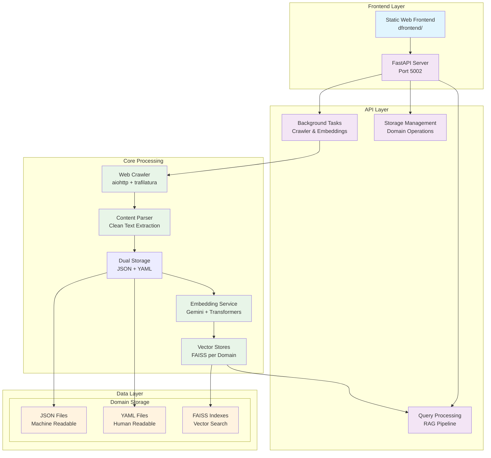
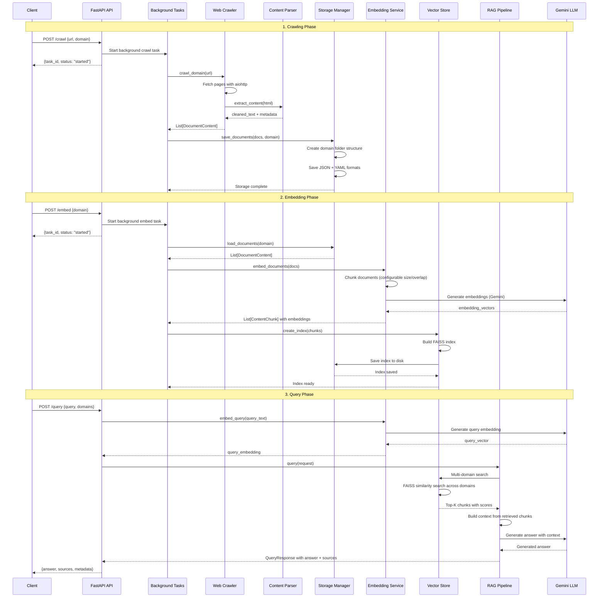
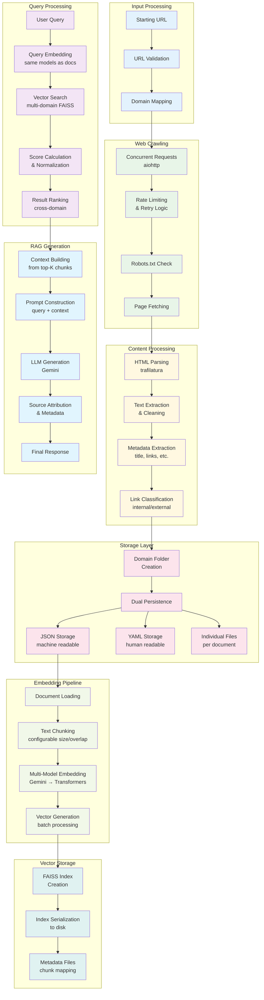
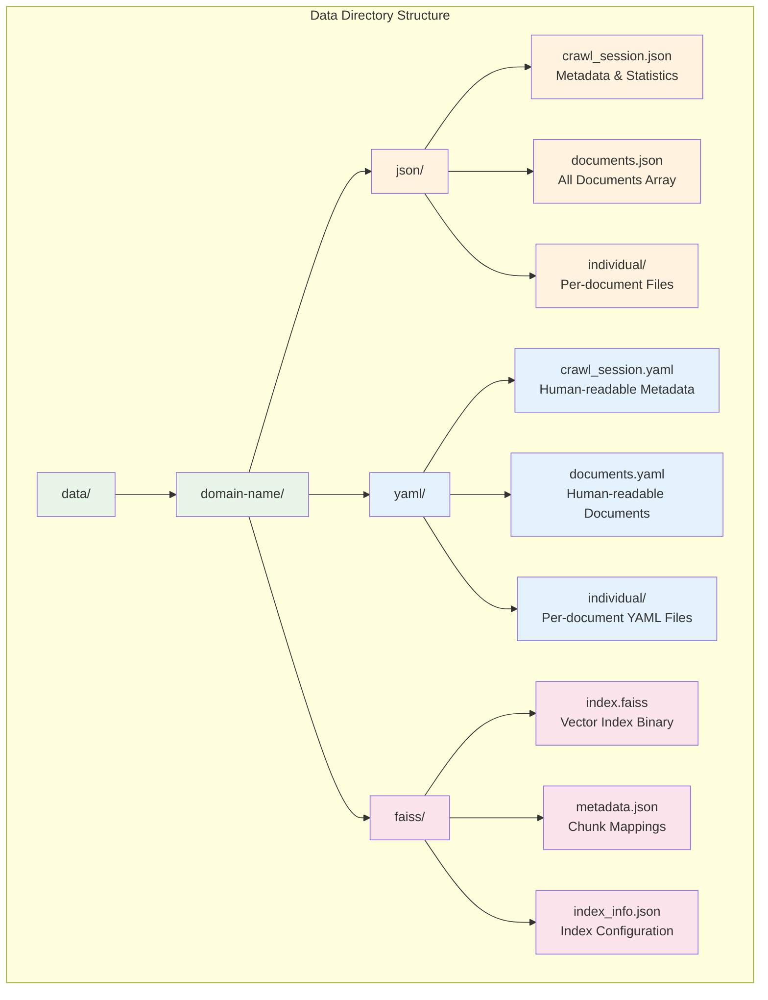
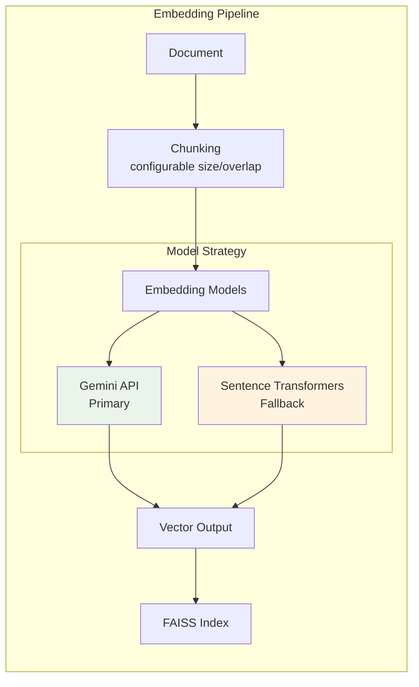
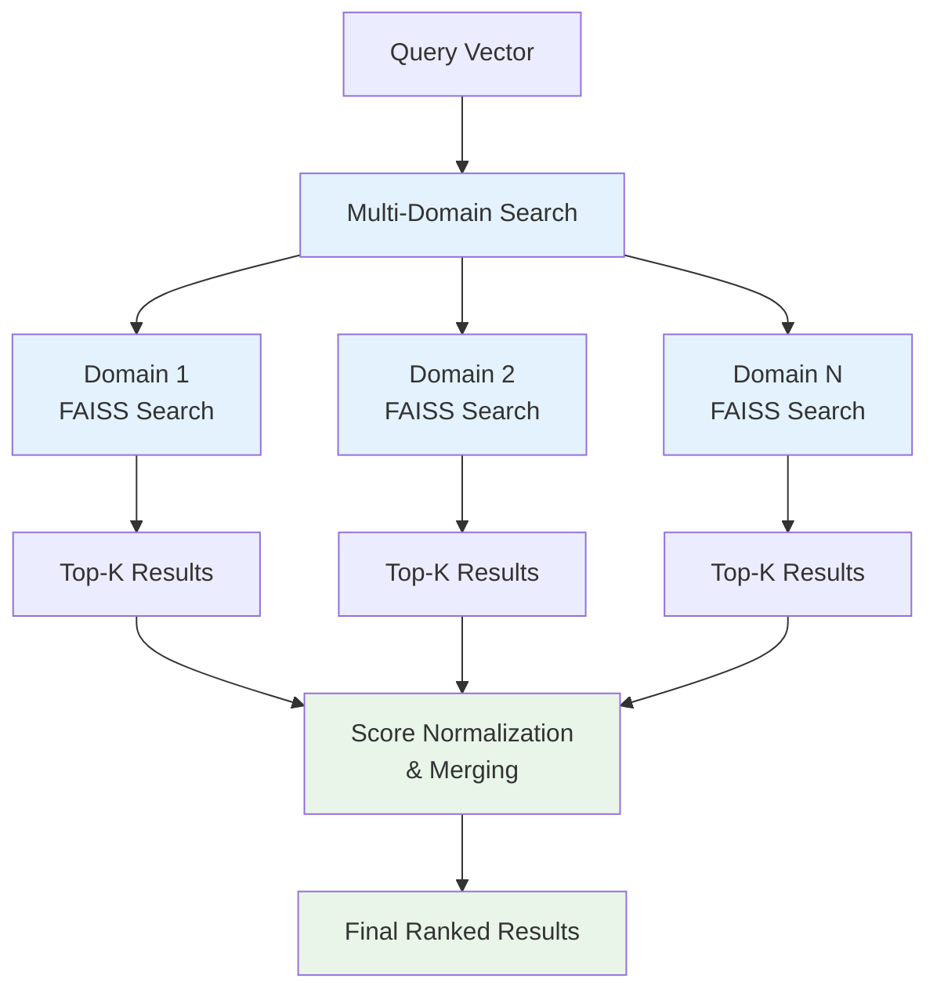

# 📄 AI-Powered Documentation Crawler & Q/A System

A comprehensive FastAPI-based RAG (Retrieval-Augmented Generation) system for intelligently crawling documentation websites and providing Q&A capabilities with advanced vector search and multi-domain support.

## 🌟 Key Features

### 🕷️ **Intelligent Web Crawling**
- Async recursive crawling with domain restriction
- Rate limiting and retry logic with exponential backoff
- Content extraction using trafilatura for clean text
- Comprehensive metadata preservation (titles, URLs, links)
- Respects robots.txt and implements polite crawling practices

### 💾 **Advanced Storage Architecture**
- **Dual format persistence**: JSON (machine-readable) + YAML (human-readable)
- **Domain-based isolation**: Separate storage per domain with organized folder structure
- **Individual document files**: Each page stored as separate file for granular access
- **Session tracking**: Complete crawl metadata and statistics

### 🧠 **Sophisticated Embedding Pipeline**
- **Multi-model support**: Gemini (primary) with sentence-transformers fallback
- **Intelligent chunking**: Configurable chunk size with overlap for optimal retrieval
- **Batch processing**: Efficient embedding generation for large document sets
- **FAISS vector stores**: High-performance similarity search per domain

### 🔍 **Advanced RAG System**
- **Multi-domain querying**: Search across multiple domains simultaneously
- **Context-aware generation**: Retrieval-augmented answers with source attribution
- **Configurable retrieval**: Adjustable top-k, context inclusion, and scoring
- **Background processing**: Async task management for long-running operations

### 🌐 **Production-Ready API**
- **FastAPI framework**: Auto-generated OpenAPI docs and validation
- **Background task management**: Track crawling and embedding progress
- **CORS support**: Cross-origin requests for frontend integration
- **Comprehensive error handling**: Detailed error messages and status codes

## 🏗️ System Architecture

### High-Level Architecture


### Detailed Code Flow



### Data Flow Architecture



## 🚀 Quick Start

### Prerequisites
- Python 3.8+ 
- Gemini API key from Google AI Studio
- Git for cloning the repository

### 1. Installation & Setup

```bash
# Clone the repository
git clone <your-repository-url>
cd docs-crawler

# Create virtual environment (recommended)
python -m venv venv

# Activate virtual environment
# On Windows:
venv\Scripts\activate
# On macOS/Linux:
source venv/bin/activate

# Install dependencies
pip install -r requirements.txt
```

### 2. Configuration

Create a `.env` file in the project root:

```env
# Required: Gemini API Configuration
GEMINI_API_KEY=your_gemini_api_key_here

# Optional: Crawler Settings (defaults shown)
MAX_CONCURRENT_REQUESTS=10
REQUEST_TIMEOUT=30
RETRY_ATTEMPTS=3
DELAY_BETWEEN_REQUESTS=1

# Optional: Storage Settings
DATA_DIR=./data
LOG_LEVEL=INFO

# Optional: Embedding Settings
CHUNK_SIZE=1000
CHUNK_OVERLAP=100
MAX_CHUNKS_PER_DOC=50

# Optional: FastAPI Settings
API_HOST=0.0.0.0
API_PORT=5002
```

### 3. Start the System

#### Option A: Using the run server script (Recommended)
```bash
python run_server.py
```

#### Option B: Direct FastAPI execution
```bash
cd src
python main.py
```

#### Option C: Using the deployment script
```bash
# For full deployment with frontend
.\deploy.bat
```

The API will be available at:
- **API Server**: http://localhost:5002
- **API Documentation**: http://localhost:5002/docs  
- **Frontend** (if deployed): http://localhost:3000

## 📡 Complete API Reference

### System Endpoints

#### Health Check
```http
GET /
```
**Response**: System status and available features

#### System Status  
```http
GET /status
```
**Response**: Detailed system information including active domains, task counts, and resource usage

### Crawling Operations

#### Start Domain Crawling
```http
POST /crawl
Content-Type: application/json

{
    "url": "https://docs.livekit.io",
    "domain_name": "livekit-docs",     # optional, auto-generated from URL if omitted
    "max_depth": 10,                  # optional, default: 5
    "max_pages": 1000                 # optional, default: 500
}
```
**Response**: Task ID for tracking progress

#### Track Crawling Progress
```http
GET /tasks/{task_id}
```
**Response**: Task status, progress, and completion details

### Embedding Operations

#### Generate Domain Embeddings
```http
POST /embed
Content-Type: application/json

{
    "domain": "livekit-docs",
    "force_rebuild": false,           # optional, default: false
    "chunk_size": 1000,              # optional, uses config default
    "chunk_overlap": 100             # optional, uses config default
}
```
**Response**: Task ID for embedding generation tracking

### Query Operations

#### Single Domain Query
```http
POST /query
Content-Type: application/json

{
    "query": "How do I set up authentication?",
    "domain": "livekit-docs",
    "top_k": 5,                      # optional, default: 5
    "include_context": true,         # optional, default: true
    "min_relevance_score": 0.7       # optional, default: 0.0
}
```

#### Multi-Domain Query
```http
POST /query/multi-domain  
Content-Type: application/json

{
    "query": "How to implement real-time features?",
    "domains": ["livekit-docs", "docs-streamlit-io"],
    "top_k": 8,                      # optional, total results across domains
    "per_domain_k": 4,              # optional, candidates per domain
    "include_context": true,
    "merge_strategy": "score_based"  # optional: "score_based" or "round_robin"
}
```

### Domain Management

#### List Available Domains
```http
GET /domains
```
**Response**: List of domains with crawling and embedding status

#### Get Domain Documents
```http
GET /domains/{domain_name}/documents?format_type=json&limit=100&offset=0
```
**Parameters**:
- `format_type`: "json" or "yaml" (default: json)  
- `limit`: Number of documents to return (default: 100)
- `offset`: Pagination offset (default: 0)

#### Validate Domains for Querying
```http
POST /domains/validate
Content-Type: application/json

{
    "domains": ["livekit-docs", "streamlit-docs"]
}
```
**Response**: Validation status per domain with embedding availability

### Advanced Operations

#### Domain Statistics
```http
GET /domains/{domain_name}/stats
```
**Response**: Comprehensive domain statistics including document count, embedding status, index size, and performance metrics

#### Bulk Operations
```http
POST /bulk/crawl
Content-Type: application/json

{
    "urls": [
        {"url": "https://docs.livekit.io", "domain_name": "livekit"},
        {"url": "https://docs.streamlit.io", "domain_name": "streamlit"}
    ],
    "max_concurrent": 2              # optional, default: 3
}
```

## 📁 Detailed Project Structure

```
docs-crawler/
├── 📄 README.md                     # This comprehensive documentation
├── 📄 requirements.txt              # Python dependencies
├── 📄 run_server.py                 # Main server launcher with path setup
├── 📄 deploy.bat                    # Full deployment script (backend + frontend)
├── 📄 .env.example                  # Environment variables template
│
├── 📁 src/                          # Core application source code
│   ├── 📄 main.py                   # FastAPI application entry point
│   ├── 📄 asgi.py                   # ASGI production configuration
│   ├── 📄 wsgi.py                   # WSGI production configuration
│   │
│   ├── 📁 config/                   # Configuration management
│   │   ├── 📄 __init__.py
│   │   └── 📄 settings.py           # Environment-based settings with validation
│   │
│   ├── 📁 api/                      # FastAPI routes and models
│   │   ├── 📄 __init__.py
│   │   ├── 📄 endpoints.py          # All API route definitions and handlers
│   │   └── 📄 models.py             # Pydantic request/response models
│   │
│   ├── 📁 crawler/                  # Web crawling engine
│   │   ├── 📄 __init__.py
│   │   ├── 📄 web_crawler.py        # Async web crawler with rate limiting
│   │   └── 📄 content_parser.py     # Content extraction with trafilatura
│   │
│   ├── 📁 storage/                  # Data persistence layer
│   │   ├── 📄 __init__.py
│   │   ├── 📄 storage_manager.py    # Domain-based storage orchestration
│   │   ├── 📄 schemas.py            # Data schemas and models
│   │   └── 📄 azure_blob.py         # Cloud storage integration (future)
│   │
│   ├── 📁 embeddings/               # Vector embeddings and search
│   │   ├── 📄 __init__.py
│   │   ├── 📄 embedding_service.py  # Multi-model embedding generation
│   │   ├── 📄 vector_store.py       # Single domain FAISS operations
│   │   └── 📄 multi_domain_vector_store.py # Cross-domain search orchestration
│   │
│   ├── 📁 qa/                       # Question answering system
│   │   ├── 📄 __init__.py
│   │   └── 📄 rag_pipeline.py       # RAG implementation with context management
│   │
│   ├── 📁 utils/                    # Utility modules
│   │   ├── 📄 __init__.py
│   │   ├── 📄 logger.py             # Structured logging configuration
│   │   └── 📄 url_utils.py          # URL normalization and validation
│   │
│   └── 📁 data/                     # Domain-organized data storage
│       ├── 📁 {domain-name}/        # Auto-created per crawled domain
│       │   ├── 📁 json/             # Machine-readable JSON files
│       │   │   ├── 📄 crawl_session.json      # Crawl metadata and stats
│       │   │   ├── 📄 documents.json          # All documents collection
│       │   │   └── 📁 individual/            # Individual document files
│       │   │       ├── 📄 doc-1.json
│       │   │       └── 📄 doc-2.json
│       │   ├── 📁 yaml/             # Human-readable YAML files
│       │   │   ├── 📄 crawl_session.yaml
│       │   │   ├── 📄 documents.yaml
│       │   │   └── 📁 individual/
│       │   └── 📁 faiss/            # Vector index files
│       │       ├── 📄 index.faiss            # FAISS vector index
│       │       ├── 📄 metadata.json          # Chunk-to-document mapping
│       │       └── 📄 index_info.json        # Index configuration
│       └── 📁 logs/                 # Application logs
│           ├── 📄 crawler_YYYYMMDD.log
│           ├── 📄 embedding_YYYYMMDD.log
│           └── 📄 api_YYYYMMDD.log
│
├── 📁 dfrontend/                    # Static web frontend
│   ├── 📄 index.html                # Main frontend application
│   ├── 📄 package.json              # Node.js dependencies (for dev tools)
│   ├── 📄 deploy.bat                # Frontend deployment script
│   ├── 📄 run.bat                   # Local frontend server
│   ├── 📁 css/
│   │   └── 📄 styles.css            # Application styles with dark/light themes
│   ├── 📁 js/
│   │   ├── 📄 config.js             # API endpoint configuration  
│   │   ├── 📄 main.js               # Core application logic
│   │   ├── 📄 api.js                # API communication layer
│   │   └── 📄 ui.js                 # UI management and interactions
│   └── 📁 assets/                   # Static assets
│
├── 📁 docs/                         # Project documentation
│   ├── 📄 project_structure.md      # Detailed architecture documentation
│   ├── 📄 AZURE_DEPLOYMENT.md       # Cloud deployment guide
│   └── 📄 *.md                      # Additional design documents
│
└── 📁 tests/                        # Test suite
    ├── 📄 test_crawl.py              # Crawling functionality tests
    ├── 📄 test_imports.py            # Import validation tests
    └── 📄 test_task_formatting.py    # Background task tests
```

## 💾 Storage Architecture Deep Dive

### Domain Folder Organization

Each crawled domain gets its own isolated storage structure:



### Storage Formats

#### 1. JSON Format (Machine Processing)
```json
{
    "id": "doc-123",
    "url": "https://docs.example.com/guide",
    "title": "Getting Started Guide", 
    "content": "Clean extracted text...",
    "metadata": {
        "crawl_timestamp": "2024-01-15T10:30:00Z",
        "content_length": 2847,
        "internal_links": ["https://docs.example.com/api"],
        "external_links": ["https://github.com/example/repo"]
    },
    "processing_info": {
        "extraction_method": "trafilatura",
        "chunk_count": 3,
        "embedded": true
    }
}
```

#### 2. YAML Format (Human Readable)
```yaml
id: doc-123
url: https://docs.example.com/guide
title: Getting Started Guide
content: |
  Clean extracted text...
  
metadata:
  crawl_timestamp: 2024-01-15T10:30:00Z
  content_length: 2847
  internal_links:
    - https://docs.example.com/api
  external_links:
    - https://github.com/example/repo

processing_info:
  extraction_method: trafilatura
  chunk_count: 3
  embedded: true
```

#### 3. FAISS Index Structure
```json
{
    "index_info": {
        "dimension": 768,
        "total_vectors": 1500,
        "index_type": "IndexFlatL2",
        "created_at": "2024-01-15T11:00:00Z"
    },
    "metadata": [
        {
            "chunk_id": "chunk-001",
            "document_id": "doc-123", 
            "chunk_index": 0,
            "start_char": 0,
            "end_char": 1000,
            "faiss_index": 0
        }
    ]
}
```

## 🔧 Comprehensive Usage Guide

### Basic Workflow Example

```python
import asyncio
import aiohttp

async def complete_workflow_example():
    """Complete example of crawling, embedding, and querying."""
    
    base_url = "http://localhost:5002"
    
    async with aiohttp.ClientSession() as session:
        
        # 1. Start crawling a documentation site
        print("🕷️ Starting crawl...")
        crawl_data = {
            "url": "https://docs.livekit.io",
            "domain_name": "livekit-docs",
            "max_depth": 5,
            "max_pages": 100
        }
        
        async with session.post(f"{base_url}/crawl", json=crawl_data) as resp:
            crawl_result = await resp.json()
            crawl_task_id = crawl_result["task_id"]
            print(f"Crawl task started: {crawl_task_id}")
        
        # 2. Monitor crawling progress
        while True:
            async with session.get(f"{base_url}/tasks/{crawl_task_id}") as resp:
                task_status = await resp.json()
                print(f"Crawl progress: {task_status['status']} - {task_status.get('progress', 0)}%")
                
                if task_status["status"] in ["completed", "failed"]:
                    break
                    
            await asyncio.sleep(5)
        
        if task_status["status"] == "failed":
            print("❌ Crawling failed!")
            return
            
        print(f"✅ Crawled {task_status.get('result', {}).get('total_documents', 0)} documents")
        
        # 3. Generate embeddings
        print("🧠 Generating embeddings...")
        embed_data = {
            "domain": "livekit-docs",
            "force_rebuild": False
        }
        
        async with session.post(f"{base_url}/embed", json=embed_data) as resp:
            embed_result = await resp.json()
            embed_task_id = embed_result["task_id"]
            print(f"Embedding task started: {embed_task_id}")
        
        # 4. Monitor embedding progress  
        while True:
            async with session.get(f"{base_url}/tasks/{embed_task_id}") as resp:
                task_status = await resp.json()
                print(f"Embedding progress: {task_status['status']} - {task_status.get('progress', 0)}%")
                
                if task_status["status"] in ["completed", "failed"]:
                    break
                    
            await asyncio.sleep(5)
        
        if task_status["status"] == "failed":
            print("❌ Embedding generation failed!")
            return
            
        print(f"✅ Generated embeddings for {task_status.get('result', {}).get('total_chunks', 0)} chunks")
        
        # 5. Query the documentation
        print("🔍 Querying documentation...")
        queries = [
            "How do I set up authentication?",
            "What are the rate limits?", 
            "How to handle real-time events?"
        ]
        
        for query in queries:
            query_data = {
                "query": query,
                "domain": "livekit-docs",
                "top_k": 3,
                "include_context": True
            }
            
            async with session.post(f"{base_url}/query", json=query_data) as resp:
                result = await resp.json()
                
                print(f"\n❓ Query: {query}")
                print(f"💬 Answer: {result['answer'][:200]}...")
                print(f"📚 Sources: {len(result['sources'])} documents")
                print(f"⚡ Response time: {result['metadata']['response_time_ms']}ms")

# Run the complete workflow
asyncio.run(complete_workflow_example())
```

### Multi-Domain Query Example

```python
async def multi_domain_example():
    """Example of querying across multiple domains."""
    
    base_url = "http://localhost:5002"
    
    async with aiohttp.ClientSession() as session:
        # Query multiple domains simultaneously
        query_data = {
            "query": "How to implement real-time messaging?",
            "domains": ["livekit-docs", "docs-streamlit-io", "twilio-com"],
            "top_k": 10,
            "per_domain_k": 4,
            "include_context": True,
            "merge_strategy": "score_based"
        }
        
        async with session.post(f"{base_url}/query/multi-domain", json=query_data) as resp:
            result = await resp.json()
            
            print(f"🔍 Multi-domain query results:")
            print(f"💬 Answer: {result['answer']}")
            print(f"📚 Total sources: {len(result['sources'])}")
            
            # Show sources by domain
            domain_counts = {}
            for source in result['sources']:
                domain = source['domain']
                domain_counts[domain] = domain_counts.get(domain, 0) + 1
            
            print("📊 Sources by domain:")
            for domain, count in domain_counts.items():
                print(f"  - {domain}: {count} sources")

asyncio.run(multi_domain_example())
```

## 🎯 Core Components Deep Dive

### 1. Web Crawler (`src/crawler/`)

The crawler is built on `aiohttp` for high-performance async operations:

#### Key Features:
- **Concurrent crawling**: Configurable concurrent request limits
- **Smart rate limiting**: Respectful crawling with delays
- **Retry logic**: Exponential backoff for failed requests  
- **Content filtering**: Domain restrictions and content validation
- **Metadata extraction**: Comprehensive page metadata capture

#### Crawler Configuration:
```python
# In .env file
MAX_CONCURRENT_REQUESTS=10    # Concurrent requests per domain
REQUEST_TIMEOUT=30           # Timeout per request (seconds)
RETRY_ATTEMPTS=3             # Max retry attempts
DELAY_BETWEEN_REQUESTS=1     # Delay between requests (seconds)
```

### 2. Content Parser (`src/crawler/content_parser.py`)

Uses `trafilatura` for clean text extraction:

#### Features:
- **Clean text extraction**: Removes ads, navigation, footers
- **Metadata preservation**: Titles, links, publication dates
- **Link classification**: Internal vs external link identification
- **Content validation**: Quality checks and minimum content requirements

### 3. Storage Manager (`src/storage/`)

Domain-based storage with dual persistence:

#### Key Capabilities:
- **Automatic domain folders**: Creates organized directory structure
- **Dual format saving**: JSON for machines, YAML for humans
- **Individual file storage**: Each document as separate file
- **Efficient retrieval**: Fast document loading and querying
- **Session tracking**: Complete crawl session metadata

### 4. Embedding Service (`src/embeddings/`)

Multi-model embedding generation with fallback:

#### Architecture:


#### Configuration Options:
```python
CHUNK_SIZE=1000              # Characters per chunk
CHUNK_OVERLAP=100            # Overlap between chunks
MAX_CHUNKS_PER_DOC=50        # Limit chunks per document
```

### 5. Vector Store (`src/embeddings/vector_store.py`)

FAISS-based similarity search:

#### Features:
- **High-performance search**: Optimized FAISS indexes
- **Metadata integration**: Chunk-to-document mapping
- **Persistent storage**: Serialized indexes to disk
- **Score normalization**: Consistent scoring across domains

### 6. Multi-Domain Vector Store

Orchestrates cross-domain search:

#### Search Strategy:


### 7. RAG Pipeline (`src/qa/rag_pipeline.py`)

Complete question-answering system:

#### Pipeline Steps:
1. **Query embedding**: Convert question to vector
2. **Similarity search**: Find relevant document chunks  
3. **Context building**: Assemble context from top results
4. **Prompt construction**: Build LLM prompt with context
5. **Answer generation**: Generate response with Gemini
6. **Source attribution**: Link answer back to sources

#### RAG Configuration:
```python
# Query parameters
top_k=5                      # Number of chunks to retrieve
include_context=True         # Include source context in response
min_relevance_score=0.0      # Minimum similarity score threshold
```

## 🔍 Monitoring and Debugging

### Logging System

Comprehensive logging across all components:

```python
# Log levels available
LOG_LEVEL=DEBUG              # Verbose debugging information
LOG_LEVEL=INFO               # General information (default)
LOG_LEVEL=WARNING            # Warning messages only
LOG_LEVEL=ERROR              # Error messages only
```

### Log Files Location:
```
data/logs/
├── crawler_YYYYMMDD.log     # Web crawling logs
├── embedding_YYYYMMDD.log   # Embedding generation logs  
├── api_YYYYMMDD.log         # API request/response logs
└── system_YYYYMMDD.log      # General system logs
```

### Background Task Monitoring

Track long-running operations:

```bash
# Get task status
curl http://localhost:5002/tasks/{task_id}

# Response format
{
    "task_id": "crawl-abc123",
    "status": "running",        # pending, running, completed, failed
    "progress": 45,             # Percentage complete
    "started_at": "2024-01-15T10:00:00Z",
    "completed_at": null,
    "result": null,             # Available when completed
    "error": null               # Available if failed
}
```

### System Health Monitoring

```bash
# System status endpoint
curl http://localhost:5002/status

# Response includes
{
    "status": "healthy",
    "uptime_seconds": 3600,
    "active_tasks": 2,
    "available_domains": ["domain1", "domain2"],
    "domains_with_embeddings": ["domain1"],
    "storage_info": {
        "total_documents": 1500,
        "total_size_mb": 45.2
    },
    "memory_usage": {
        "current_mb": 512,
        "peak_mb": 768
    }
}
```

# Crawler Settings
MAX_CONCURRENT_REQUESTS=10
REQUEST_TIMEOUT=30
RETRY_ATTEMPTS=3
DELAY_BETWEEN_REQUESTS=1

# Storage Settings
DATA_DIR=./data
LOG_LEVEL=INFO

# Embedding Settings
CHUNK_SIZE=1000
CHUNK_OVERLAP=100
MAX_CHUNKS_PER_DOC=50

# FastAPI Settings
API_HOST=0.0.0.0
API_PORT=8000

### 3. Run the Server

```bash
cd src
python main.py
```

The API will be available at `http://localhost:8000`

## 📡 API Endpoints

### Health Check
```bash
GET /
```

### Start Crawling
```bash
POST /crawl
{
    "url": "https://docs.livekit.io",
    "domain_name": "livekit-docs",  # optional
    "max_depth": 10  # optional
}
```

### Generate Embeddings
```bash
POST /embed
{
    "domain": "livekit-docs"
}
```

### Query Documentation
```bash
POST /query
{
    "query": "How do I set up authentication?",
    "domain": "livekit-docs",
    "top_k": 5,
    "include_context": true
}
```

### List Domains
```bash
GET /domains
```

### Get Documents
```bash
GET /domains/{domain_name}/documents?format_type=json
```

### Check Task Status
```bash
GET /tasks/{task_id}
```

### System Status
```bash
GET /status
```

## 📁 Project Structure

```
src/
├── main.py                    # FastAPI application entry point
├── config/
│   ├── __init__.py
│   └── settings.py            # Configuration settings
├── crawler/
│   ├── __init__.py
│   ├── web_crawler.py         # Main crawler logic
│   └── content_parser.py      # Content extraction with trafilatura
├── storage/
│   ├── __init__.py
│   ├── storage_manager.py     # JSON/YAML storage with domain folders
│   └── schemas.py             # Data schemas
├── embeddings/
│   ├── __init__.py
│   ├── embedding_service.py   # Gemini + sentence-transformers
│   └── vector_store.py        # FAISS operations
├── qa/
│   ├── __init__.py
│   └── rag_pipeline.py        # RAG Q/A system
├── api/
│   ├── __init__.py
│   ├── endpoints.py           # FastAPI routes
│   └── models.py              # Pydantic models
└── utils/
    ├── __init__.py
    ├── url_utils.py           # URL normalization and validation
    └── logger.py              # Logging configuration

data/                          # Domain-based storage structure
├── {domain_name}/            # e.g., livekit-docs/
│   ├── json/                 # JSON files
│   ├── yaml/                 # YAML files
│   └── faiss/                # FAISS index files
└── logs/                     # Application logs
```

## 💾 Data Storage Structure

### Domain Folder Organization
```
data/
└── livekit-docs/                    # Domain folder
    ├── json/
    │   ├── crawl_session.json       # Crawl metadata
    │   ├── documents.json           # All documents
    │   └── individual/              # Individual document files
    │       ├── getting-started.json
    │       └── api-reference.json
    ├── yaml/
    │   ├── crawl_session.yaml       # Human-readable metadata
    │   ├── documents.yaml           # All documents
    │   └── individual/              # Individual document files
    │       ├── getting-started.yaml
    │       └── api-reference.yaml
    └── faiss/
        ├── index.faiss              # FAISS vector index
        ├── metadata.json            # Chunk metadata
        └── index_info.json          # Index information
```

## 🔧 Usage Examples

### Basic Crawling and Q/A

```python
import asyncio
import aiohttp
import json

async def crawl_and_query():
    base_url = "http://localhost:8000"
    
    # 1. Start crawling
    async with aiohttp.ClientSession() as session:
        # Crawl documentation
        crawl_data = {
            "url": "https://docs.livekit.io",
            "domain_name": "livekit-docs"
        }
        async with session.post(f"{base_url}/crawl", json=crawl_data) as resp:
            result = await resp.json()
            print(f"Crawling started: {result['message']}")
        
        # Wait for crawling to complete (check task status)
        await asyncio.sleep(30)  # Adjust based on site size
        
        # Generate embeddings
        embed_data = {"domain": "livekit-docs"}
        async with session.post(f"{base_url}/embed", json=embed_data) as resp:
            result = await resp.json()
            print(f"Embedding started: {result['message']}")
        
        # Wait for embedding generation
        await asyncio.sleep(10)
        
        # Query the documentation
        query_data = {
            "query": "How do I authenticate users?",
            "domain": "livekit-docs",
            "top_k": 3
        }
        async with session.post(f"{base_url}/query", json=query_data) as resp:
            result = await resp.json()
            print(f"Answer: {result['answer']}")
            print(f"Sources: {len(result['sources'])} found")

# Run the example
asyncio.run(crawl_and_query())
```

### Direct API Usage

```python
from src.crawler.web_crawler import WebCrawler
from src.storage.storage_manager import StorageManager
from src.embeddings.embedding_service import EmbeddingService
from src.embeddings.vector_store import VectorStore
from src.qa.rag_pipeline import RAGPipeline

async def direct_usage():
    # 1. Crawl documentation
    async with WebCrawler() as crawler:
        session = await crawler.crawl_domain("https://docs.livekit.io")
        documents = crawler.crawled_documents
    
    # 2. Save to storage
    storage = StorageManager()
    domain_folder = storage.get_domain_folder(session.start_url, "livekit-docs")
    storage.save_documents(documents, domain_folder)
    
    # 3. Generate embeddings
    embedding_service = EmbeddingService()
    await embedding_service.initialize()
    chunks = await embedding_service.embed_documents(documents)
    
    # 4. Create vector store
    vector_store = VectorStore("livekit-docs", domain_folder)
    vector_store.create_index(chunks, "sentence-transformer")
    
    # 5. Setup RAG pipeline
    rag = RAGPipeline()
    await rag.initialize()
    rag.add_vector_store("livekit-docs", vector_store)
    
    # 6. Query
    from src.storage.schemas import QueryRequest
    query = QueryRequest(
        query="How do I set up authentication?",
        domain="livekit-docs"
    )
    response = await rag.query(query)
    print(f"Answer: {response.answer}")
```

## 🎯 Key Features Explained

### 1. Domain-Based Organization
- Each crawled domain gets its own folder
- Separate storage for JSON (machine-readable) and YAML (human-readable)
- FAISS indexes stored per domain for efficient retrieval

### 2. Intelligent Crawling
- Respects robots.txt and rate limits
- Domain restriction prevents crawling external sites
- Async processing for high performance
- Retry logic with exponential backoff

### 3. Advanced Content Processing
- Clean text extraction using trafilatura
- Automatic chunking for optimal embedding
- Metadata preservation (title, URL, links)
- Link classification (internal/external)

### 4. Flexible Embedding Strategy
- Primary: Gemini embeddings for high quality
- Fallback: sentence-transformers for reliability
- Configurable chunk size and overlap
- Efficient batch processing

### 5. Powerful Q/A System
- Retrieval-Augmented Generation (RAG)
- Context-aware answer generation
- Source attribution and confidence scoring
- Configurable retrieval parameters

## 🔍 Monitoring and Logging

### Check System Status
```bash
curl http://localhost:8000/status
```

### View Logs
```bash
tail -f data/logs/crawler_$(date +%Y%m%d).log
```

### Monitor Background Tasks
```bash
curl http://localhost:8000/tasks/{task_id}
```

## 🛠️ Customization

### Adding New Embedding Models
1. Extend `EmbeddingService` class
2. Add model initialization in `_init_*` methods
3. Implement embedding generation logic

### Custom Content Parsers
1. Extend `ContentParser` class
2. Override parsing methods as needed
3. Add custom metadata extraction

### Additional API Endpoints
1. Add routes in `endpoints.py`
2. Create request/response models in `models.py`
3. Implement business logic

## 🔒 Security Considerations

- API key management via environment variables
- Input validation on all endpoints
- Rate limiting (implement as needed)
- CORS configuration
- File path sanitization

## 🐛 Troubleshooting

### Common Issues

1. **Import Errors**: Make sure all dependencies are installed
   ```bash
   pip install -r requirements.txt
   ```

2. **API Key Issues**: Ensure Gemini API key is set correctly
   ```bash
   export GEMINI_API_KEY=your_key_here
   ```

3. **Memory Issues**: Reduce `MAX_CONCURRENT_REQUESTS` for large sites
   ```env
   MAX_CONCURRENT_REQUESTS=5
   ```

4. **Slow Crawling**: Adjust delay settings
   ```env
   DELAY_BETWEEN_REQUESTS=0.5
   ```

### Debug Mode
Enable debug logging:
```env
LOG_LEVEL=DEBUG
```

## � Deployment

### Render Deployment

This application is configured for deployment on Render with both Docker and native Python support.

#### Files Created for Deployment:
- `Procfile` - Process definition for native Python deployment
- `Dockerfile` - Container configuration for Docker deployment
- `gunicorn.conf.py` - Gunicorn configuration for production WSGI server
- Updated `requirements.txt` - Added gunicorn dependency

#### Deployment Steps:

1. **Connect Repository**: Connect your GitHub repository to Render

2. **Choose Deployment Method**:
   - **Docker**: Select "Docker" as runtime, uses `Dockerfile`
   - **Native Python**: Select "Python", uses `Procfile` and `requirements.txt`

3. **Environment Variables**: Set the following in Render dashboard:
   ```
   GEMINI_API_KEY=your_gemini_api_key
   PYTHONPATH=/app/src
   LOG_LEVEL=INFO
   ```

4. **Build & Deploy**: Render will automatically build and deploy your application

#### Production Configuration:
- Uses Gunicorn with Uvicorn workers for optimal FastAPI performance
- Automatically scales workers based on CPU cores
- Configurable via `gunicorn.conf.py`
- Supports Render's dynamic PORT assignment

## �📝 License

[Add your license information here]

## 🤝 Contributing

1. Fork the repository
2. Create a feature branch
3. Make your changes
4. Add tests if applicable
5. Submit a pull request

## 📞 Support

For issues and questions:
- Create an issue on GitHub
- Check the logs in `data/logs/`