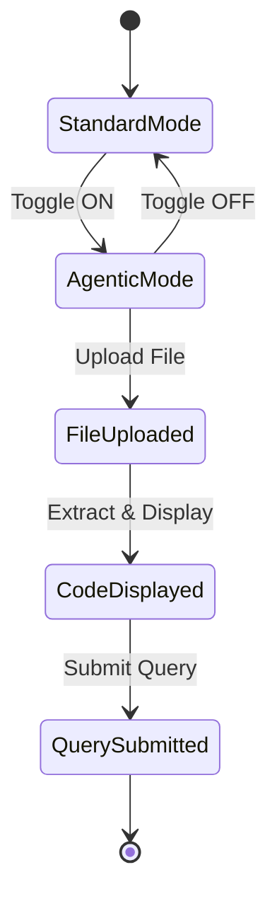
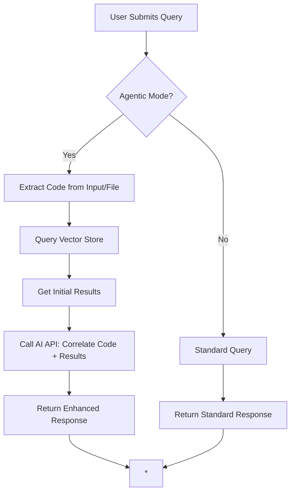
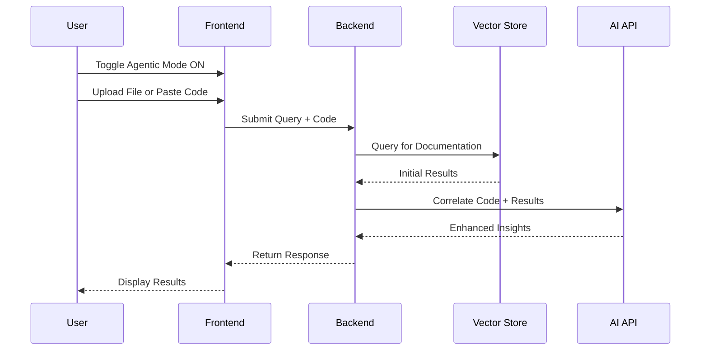

# Agentic Mode Implementation Approach

## Overview

The current documentation crawler and Q/A system operates by searching for content based solely on user prompts. To make the application "agentic," we introduce an "Agentic Mode" that enhances query capabilities by incorporating user-provided code or files. This mode allows for more contextual and relevant responses by connecting fetched documentation with the user's code, enabling better integration and understanding.

In Agentic Mode:
- Users can upload files (e.g., code files) or paste code directly.
- The system performs a standard query based on the user command.
- After retrieving results, it uses an AI API to correlate the response with the provided code, improving relevance and providing code-specific insights.

This approach transforms the system from a passive retriever to an active agent that understands and connects documentation with practical code usage.

## UI Changes

### Toggle Button
- Add a toggle switch labeled "Agentic Mode" in the main interface (e.g., near the query input).
- When toggled on, reveal additional UI elements for code input and file upload.
- When toggled off, hide these elements and revert to standard query mode.

### New Text Input Box
- A multi-line text area for pasting or displaying extracted code.
- Label: "Code Context"
- Placeholder: "Paste your code here or upload a file..."
- When a file is uploaded, prepend the filename as a header (e.g., "### filename.py") and append the extracted content.

### File Upload Option
- A file input button allowing users to select and upload code files (e.g., .py, .js, .ts, etc.).
- Supported formats: Common programming languages (Python, JavaScript, TypeScript, etc.).
- Upon upload, extract text content and populate the text input box.
- Display upload progress and success/error messages.

### UI Layout
- Standard Mode: Query input box only.
- Agentic Mode: Query input box + Code Context text area + File upload button.

### Example UI Flow
```
[Query Input]
[Toggle: Agentic Mode] [ON/OFF]

When ON:
[Query Input]
[Code Context Text Area]
[Upload File Button]
```

## Backend Changes

### Query Processing
1. **Standard Query**: Process the user prompt as before, retrieving relevant documentation from the vector store.
2. **Agentic Enhancement**: After retrieving initial results, send the query, fetched response, and provided code to an AI API for correlation.
   - API Call: Use a service like Gemini or OpenAI to analyze how the documentation relates to the code.
   - Example Prompt: "Given this code: [code], and this documentation: [response], explain how they connect and provide relevant insights."
   - Return enhanced response that integrates code-specific context.

### File Handling
- On file upload, extract text content using appropriate parsers (e.g., for Python files, read as plain text).
- Store extracted content temporarily for the session.
- Ensure security: Validate file types, scan for malicious content if necessary.

### API Integration
- Integrate with an AI model (e.g., Gemini via `GEMINI_API_KEY`) to perform the correlation.
- Handle async processing for the API call to avoid blocking the UI.
- Fallback: If API fails, return the standard query result with a note.

### Data Flow
- User submits query + code (if in agentic mode).
- Backend: Query vector store → Get initial results → (If agentic) Call AI API with code + results → Return enhanced response.

## Diagrams

### UI State Diagram


### Backend Process Flow


### Sequence Diagram for Agentic Query


## Implementation Considerations
- **Security**: Implement file upload restrictions (size, type) to prevent abuse.
- **Performance**: AI API calls may add latency; consider caching or async handling.
- **User Experience**: Provide clear feedback during processing (loading indicators).
- **Extensibility**: Design the AI correlation as a modular component for future enhancements.
- **Testing**: Ensure standard mode remains unaffected; test agentic mode with various code types.

This approach maintains the core functionality while adding intelligent code-awareness, making the system more useful for developers integrating documentation with their codebases.