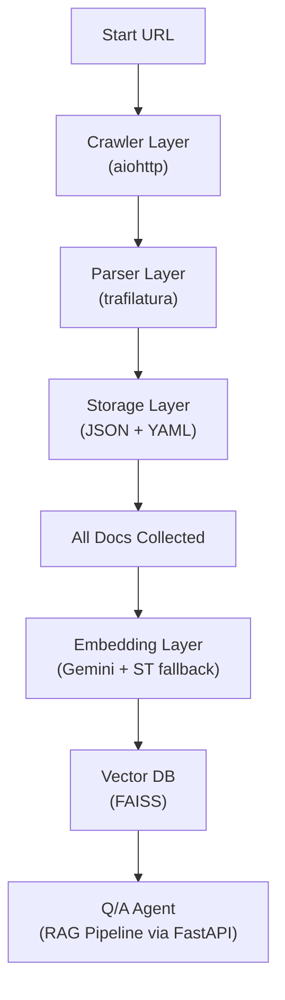
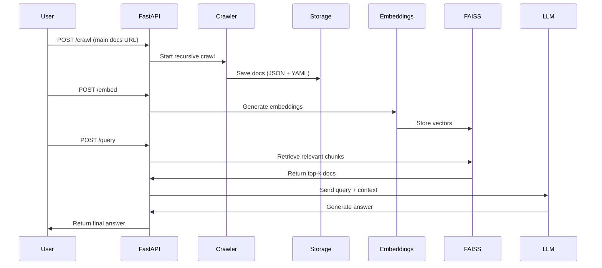

# 📄 AI-Powered Documentation Crawler & Q/A System

## 1. Problem
The current documentation structure (e.g., LiveKit docs) is difficult to navigate and inefficient. Manually searching through multiple pages is time-consuming, and existing docs often lack a smooth search + Q/A experience. Crawling them manually or relying on limited site search does not scale.

## 2. Aim
- Automatically crawl the entire documentation website once.
- Extract all relevant content and links into structured formats (YAML + JSON).
- Build a knowledge base that can later be embedded and indexed.
- Enable a **Q/A agent** using a Retrieval-Augmented Generation (RAG) pipeline on top of the crawled docs.
- Wrap everything with **FastAPI** to expose an easy-to-use API for querying.

## 3. Approach
1. **Crawler Layer**
   - Input: main docs URL.
   - Use a recursive crawler to fetch pages within the docs domain.
   - Maintain a visited set to avoid cycles.
   - Collect both internal and external links (external stored but not visited).

2. **Parser Layer**
   - Extract main readable text using `trafilatura`.
   - Collect metadata: URL, title, clean content, internal/external links.

3. **Storage Layer**
   - Store results in **both JSON and YAML**:
     - JSON → machine-friendly for embeddings and RAG.
     - YAML → human-friendly for inspection.

4. **Traversal Logic**
   - BFS/DFS recursion until all docs pages are visited.
   - Normalize URLs (strip anchors, handle query params).

5. **Embedding + Indexing (Post-Processing)**
   - After crawl is complete:
     - Chunk content into 500–1000 token sections.
     - Embed chunks using Gemini embeddings.
     - Fallback: `sentence-transformers` if Gemini fails.
     - Store embeddings in **FAISS** for local, lightweight vector search.

6. **Q/A Agent**
   - Implement a **RAG pipeline**:
     - Embed query → retrieve top-k chunks from FAISS → pass to LLM → return coherent answer.
   - API endpoints in FastAPI for `query` requests.

---

## 4. Tech Stack
- **Crawler**: `aiohttp` (async fetching)
- **Parser**: `trafilatura` (main text extraction)
- **Storage**: `PyYAML`, built-in `json`
- **Framework**: `FastAPI` (API endpoints)
- **Embeddings**: Gemini (primary), `sentence-transformers` (fallback)
- **Vector DB**: FAISS
- **Orchestration**: Python, custom recursion with visited-set

---

## 5. Application Architecture

### High-Level Flow

### FastAPI Endpoint Workflow

---

## 6. FastAPI Integration
- **Endpoints**:
  - `POST /crawl` → Start crawling a docs domain.
  - `GET /docs` → Retrieve stored docs in JSON/YAML.
  - `POST /embed` → Generate embeddings + store in FAISS.
  - `POST /query` → Accepts natural language query, retrieves context, returns AI-generated answer.

- **Flow**:
  1. Start with `/crawl` once for the docs.
  2. Run `/embed` to prepare embeddings.
  3. Use `/query` for Q/A over docs.

