# AI-Powered Documentation Crawler - Micro-Level Architecture System

## Executive Summary
The AI-Powered Documentation Crawler is a comprehensive RAG (Retrieval-Augmented Generation) system built on FastAPI that crawls documentation websites, processes content through advanced embeddings, and provides intelligent Q/A capabilities using Google's Gemini LLM with sophisticated fallback mechanisms.

---

## 1. System Architecture Overview

### 1.1 High-Level Architecture

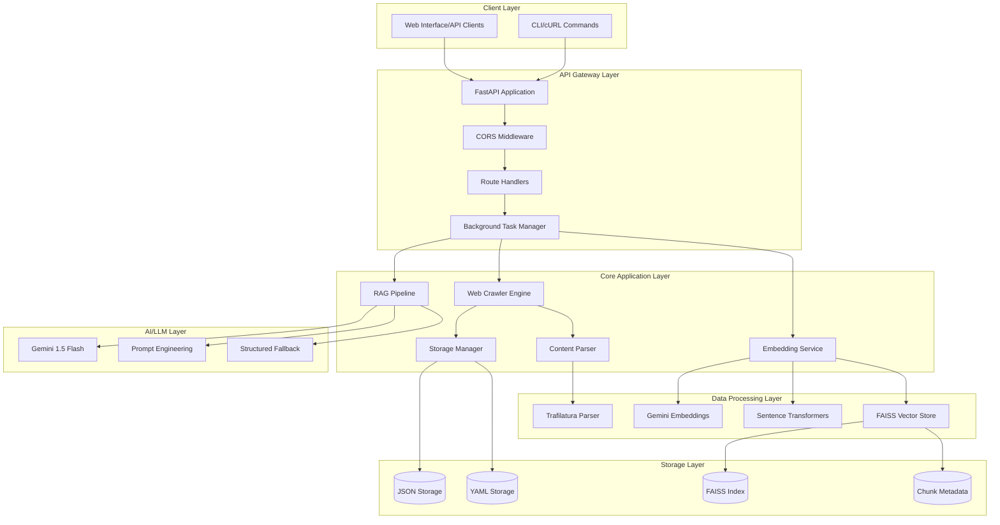
```mermaid
graph TB
    subgraph "Client Layer"
        UI[Web Interface/API Clients]
        CURL[CLI/cURL Commands]
    end
    
    subgraph "API Gateway Layer"
        FASTAPI[FastAPI Application]
        CORS[CORS Middleware]
        ROUTES[Route Handlers]
        TASKS[Background Task Manager]
    end
    
    subgraph "Core Application Layer"
        CRAWLER[Web Crawler Engine]
        PARSER[Content Parser]
        STORAGE[Storage Manager]
        EMBEDDINGS[Embedding Service]
        RAG[RAG Pipeline]
    end
    
    subgraph "Data Processing Layer"
        TRAFILATURA[Trafilatura Parser]
        GEMINI_EMB[Gemini Embeddings]
        SENTENCE_T[Sentence Transformers]
        FAISS[FAISS Vector Store]
    end
    
    subgraph "AI/LLM Layer"
        GEMINI_LLM[Gemini 1.5 Flash]
        PROMPT_ENG[Prompt Engineering]
        FALLBACK[Structured Fallback]
    end
    
    subgraph "Storage Layer"
        JSON_STORE[(JSON Storage)]
        YAML_STORE[(YAML Storage)]
        VECTOR_DB[(FAISS Index)]
        METADATA[(Chunk Metadata)]
    end
    
    UI --> FASTAPI
    CURL --> FASTAPI
    FASTAPI --> CORS
    CORS --> ROUTES
    ROUTES --> TASKS
    TASKS --> CRAWLER
    TASKS --> EMBEDDINGS
    TASKS --> RAG
    CRAWLER --> PARSER
    PARSER --> TRAFILATURA
    CRAWLER --> STORAGE
    STORAGE --> JSON_STORE
    STORAGE --> YAML_STORE
    EMBEDDINGS --> GEMINI_EMB
    EMBEDDINGS --> SENTENCE_T
    EMBEDDINGS --> FAISS
    FAISS --> VECTOR_DB
    FAISS --> METADATA
    RAG --> GEMINI_LLM
    RAG --> PROMPT_ENG
    RAG --> FALLBACK
```

### 1.2 Technology Stack

| Layer | Technology | Purpose |
|-------|------------|---------|
| **API Framework** | FastAPI | Async REST API with automatic documentation |
| **Web Crawling** | aiohttp, trafilatura | Async HTTP requests and content extraction |
| **Storage** | JSON, YAML, FAISS | Dual-format storage with vector indexing |
| **Embeddings** | Google Generative AI, sentence-transformers | Primary + fallback embedding generation |
| **Vector Search** | FAISS | High-performance similarity search |
| **LLM** | Google Gemini 1.5 Flash | Advanced language model for responses |
| **Configuration** | python-dotenv, Pydantic | Environment and settings management |
| **Logging** | Python logging | Structured application logging |

### 1.3 High-Level System Overview

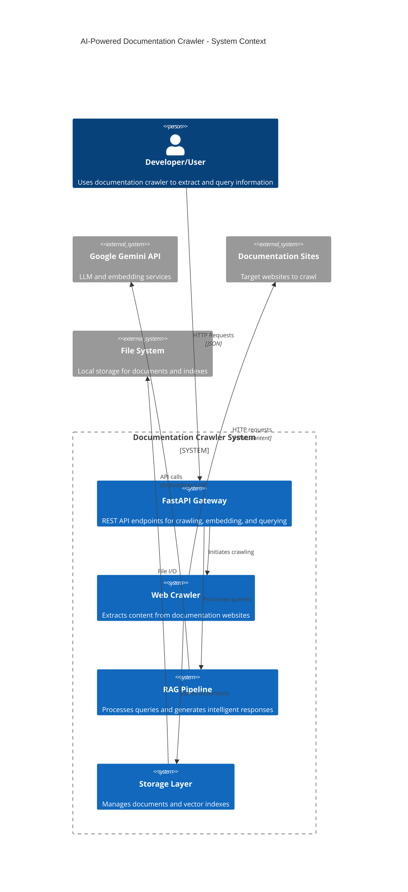
```mermaid
C4Context
    title AI-Powered Documentation Crawler - System Context

    Person(user, "Developer/User", "Uses documentation crawler to extract and query information")
    
    System_Boundary(crawler_system, "Documentation Crawler System") {
        System(api_gateway, "FastAPI Gateway", "REST API endpoints for crawling, embedding, and querying")
        System(crawler_service, "Web Crawler", "Extracts content from documentation websites")
        System(rag_service, "RAG Pipeline", "Processes queries and generates intelligent responses")
        System(storage_service, "Storage Layer", "Manages documents and vector indexes")
    }
    
    System_Ext(gemini_api, "Google Gemini API", "LLM and embedding services")
    System_Ext(websites, "Documentation Sites", "Target websites to crawl")
    System_Ext(file_system, "File System", "Local storage for documents and indexes")
    
    Rel(user, api_gateway, "HTTP Requests", "JSON")
    Rel(api_gateway, crawler_service, "Initiates crawling")
    Rel(api_gateway, rag_service, "Processes queries")
    Rel(crawler_service, websites, "HTTP requests", "HTML content")
    Rel(crawler_service, storage_service, "Stores documents")
    Rel(rag_service, gemini_api, "API calls", "Embeddings/LLM")
    Rel(storage_service, file_system, "File I/O")
```

### 1.4 Service Architecture Overview

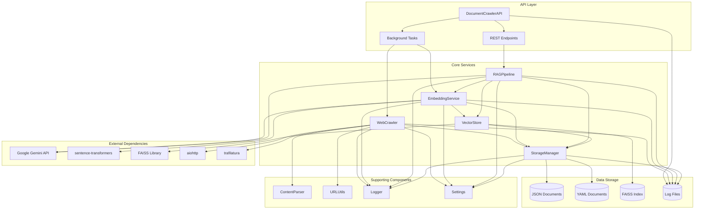
```mermaid
graph TB
    subgraph "API Layer"
        FASTAPI[DocumentCrawlerAPI]
        ENDPOINTS[REST Endpoints]
        BG_TASKS[Background Tasks]
    end

    subgraph "Core Services"
        WEBCRAWLER[WebCrawler]
        EMBEDDINGSVC[EmbeddingService]
        RAGPIPELINE[RAGPipeline]
        VECTORSTORE[VectorStore]
        STORAGEMGR[StorageManager]
    end

    subgraph "Supporting Components"
        CONTENTPARSER[ContentParser]
        URLUTILS[URLUtils]
        LOGGER[Logger]
        CONFIG[Settings]
    end

    subgraph "External Dependencies"
        GEMINI_API[Google Gemini API]
        SENTENCE_TRANSFORMERS[sentence-transformers]
        FAISS[FAISS Library]
        AIOHTTP[aiohttp]
        TRAFILATURA[trafilatura]
    end

    subgraph "Data Storage"
        JSON_FILES[(JSON Documents)]
        YAML_FILES[(YAML Documents)]
        FAISS_INDEX[(FAISS Index)]
        LOG_FILES[(Log Files)]
    end

    FASTAPI --> ENDPOINTS
    FASTAPI --> BG_TASKS

    BG_TASKS --> WEBCRAWLER
    BG_TASKS --> EMBEDDINGSVC
    ENDPOINTS --> RAGPIPELINE

    WEBCRAWLER --> CONTENTPARSER
    WEBCRAWLER --> STORAGEMGR

    EMBEDDINGSVC --> VECTORSTORE
    EMBEDDINGSVC --> STORAGEMGR

    RAGPIPELINE --> EMBEDDINGSVC
    RAGPIPELINE --> VECTORSTORE
    RAGPIPELINE --> STORAGEMGR

    VECTORSTORE --> STORAGEMGR

    WEBCRAWLER --> URLUTILS
    WEBCRAWLER --> LOGGER
    WEBCRAWLER --> CONFIG

    EMBEDDINGSVC --> LOGGER
    EMBEDDINGSVC --> CONFIG

    RAGPIPELINE --> LOGGER
    RAGPIPELINE --> CONFIG

    STORAGEMGR --> LOGGER
    STORAGEMGR --> CONFIG

    WEBCRAWLER --> AIOHTTP
    WEBCRAWLER --> TRAFILATURA

    EMBEDDINGSVC --> GEMINI_API
    EMBEDDINGSVC --> SENTENCE_TRANSFORMERS

    RAGPIPELINE --> GEMINI_API

    VECTORSTORE --> FAISS

    STORAGEMGR --> JSON_FILES
    STORAGEMGR --> YAML_FILES
    VECTORSTORE --> FAISS_INDEX

    FASTAPI --> LOG_FILES
    WEBCRAWLER --> LOG_FILES
    EMBEDDINGSVC --> LOG_FILES
    RAGPIPELINE --> LOG_FILES
    STORAGEMGR --> LOG_FILES
```

### 1.5 Deployment Architecture

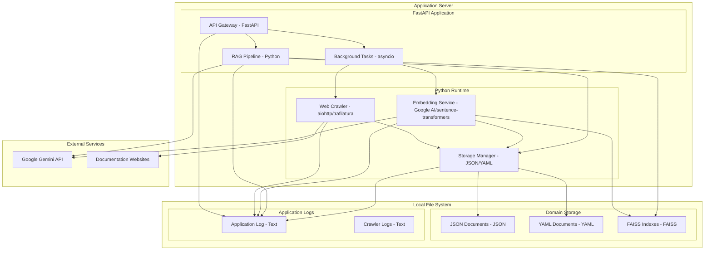
```mermaid
graph TB
    subgraph "Application Server"
        subgraph "FastAPI Application"
            API[API Gateway - FastAPI]
            BG[Background Tasks - asyncio]
            RAG[RAG Pipeline - Python]
        end

        subgraph "Python Runtime"
            WC[Web Crawler - aiohttp/trafilatura]
            ES[Embedding Service - Google AI/sentence-transformers]
            SM[Storage Manager - JSON/YAML]
        end
    end

    subgraph "Local File System"
        subgraph "Domain Storage"
            JSON[JSON Documents - JSON]
            YAML[YAML Documents - YAML]
            FAISS[FAISS Indexes - FAISS]
        end

        subgraph "Application Logs"
            APP_LOG[Application Log - Text]
            CRAWLER_LOG[Crawler Logs - Text]
        end
    end

    subgraph "External Services"
        GEMINI[Google Gemini API]
        WEBSITES[Documentation Websites]
    end

    API --> BG
    BG --> WC
    BG --> ES
    API --> RAG

    WC --> SM
    ES --> SM
    RAG --> SM

    SM --> JSON
    SM --> YAML
    ES --> FAISS
    RAG --> FAISS

    WC --> WEBSITES
    ES --> GEMINI
    RAG --> GEMINI

    API --> APP_LOG
    WC --> APP_LOG
    ES --> APP_LOG
    RAG --> APP_LOG
    SM --> APP_LOG
```
---

## 2. Abstract Services Layer

### 2.1 Core Classes & Data Models

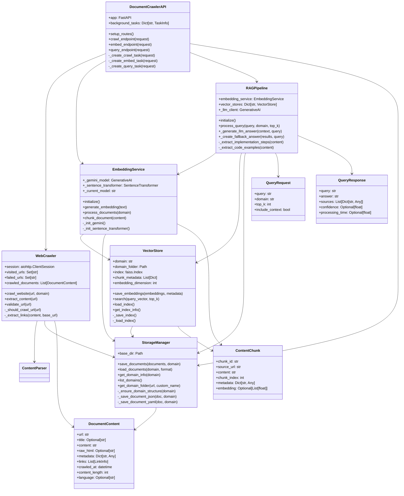
```mermaid
classDiagram
    class DocumentCrawlerAPI {
        +app: FastAPI
        +background_tasks: Dict[str, TaskInfo]
        +setup_routes()
        +crawl_endpoint(request)
        +embed_endpoint(request)
        +query_endpoint(request)
        -_create_crawl_task(request)
        -_create_embed_task(request)
        -_create_query_task(request)
    }
    
    class WebCrawler {
        +session: aiohttp.ClientSession
        +visited_urls: Set[str]
        +failed_urls: Set[str]
        +crawled_documents: List[DocumentContent]
        +crawl_website(url, domain)
        +extract_content(url)
        +validate_url(url)
        -_should_crawl_url(url)
        -_extract_links(content, base_url)
    }
    
    class EmbeddingService {
        +_gemini_model: GenerativeAI
        +_sentence_transformer: SentenceTransformer
        +_current_model: str
        +initialize()
        +generate_embedding(text)
        +process_documents(domain)
        +chunk_document(content)
        -_init_gemini()
        -_init_sentence_transformer()
    }
    
    class VectorStore {
        +domain: str
        +domain_folder: Path
        +index: faiss.Index
        +chunk_metadata: List[Dict]
        +embedding_dimension: int
        +save_embeddings(embeddings, metadata)
        +search(query_vector, top_k)
        +load_index()
        +get_index_info()
        -_save_index()
        -_load_index()
    }
    
    class RAGPipeline {
        +embedding_service: EmbeddingService
        +vector_stores: Dict[str, VectorStore]
        +_llm_client: GenerativeAI
        +initialize()
        +process_query(query, domain, top_k)
        +_generate_llm_answer(context, query)
        +_create_fallback_answer(results, query)
        -_extract_implementation_steps(content)
        -_extract_code_examples(content)
    }
    
    class StorageManager {
        +base_dir: Path
        +save_documents(documents, domain)
        +load_documents(domain, format)
        +get_domain_info(domain)
        +list_domains()
        +get_domain_folder(url, custom_name)
        -_ensure_domain_structure(domain)
        -_save_document_json(doc, domain)
        -_save_document_yaml(doc, domain)
    }
    
    class DocumentContent {
        +url: str
        +title: Optional[str]
        +content: str
        +raw_html: Optional[str]
        +metadata: Dict[str, Any]
        +links: List[LinkInfo]
        +crawled_at: datetime
        +content_length: int
        +language: Optional[str]
    }
    
    class ContentChunk {
        +chunk_id: str
        +source_url: str
        +content: str
        +chunk_index: int
        +metadata: Dict[str, Any]
        +embedding: Optional[List[float]]
    }
    
    class QueryRequest {
        +query: str
        +domain: str
        +top_k: int
        +include_context: bool
    }
    
    class QueryResponse {
        +query: str
        +answer: str
        +sources: List[Dict[str, Any]]
        +confidence: Optional[float]
        +processing_time: Optional[float]
    }
    
    DocumentCrawlerAPI --> WebCrawler
    DocumentCrawlerAPI --> EmbeddingService
    DocumentCrawlerAPI --> RAGPipeline
    DocumentCrawlerAPI --> StorageManager
    
    WebCrawler --> ContentParser
    WebCrawler --> StorageManager
    
    EmbeddingService --> VectorStore
    EmbeddingService --> StorageManager
    
    RAGPipeline --> EmbeddingService
    RAGPipeline --> VectorStore
    RAGPipeline --> StorageManager
    
    VectorStore --> StorageManager
    
    RAGPipeline --> QueryRequest
    RAGPipeline --> QueryResponse
    
    WebCrawler --> DocumentContent
    StorageManager --> DocumentContent
    EmbeddingService --> ContentChunk
    VectorStore --> ContentChunk
```

### 2.2 Service Boundaries & Responsibilities

#### 2.2.1 Core Component Boundaries

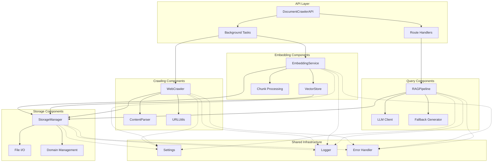
```mermaid
graph TB
    subgraph "API Layer"
        DCA[DocumentCrawlerAPI]
        ROUTES[Route Handlers]
        TASKS[Background Tasks]

        DCA --> ROUTES
        DCA --> TASKS
    end

    subgraph "Crawling Components"
        WC[WebCrawler]
        CP[ContentParser]
        URL_UTILS[URLUtils]

        WC --> CP
        WC --> URL_UTILS
    end

    subgraph "Embedding Components"
        ES[EmbeddingService]
        VS[VectorStore]
        CHUNK_PROC[Chunk Processing]

        ES --> VS
        ES --> CHUNK_PROC
    end

    subgraph "Query Components"
        RP[RAGPipeline]
        LLM_CLIENT[LLM Client]
        FALLBACK_GEN[Fallback Generator]

        RP --> LLM_CLIENT
        RP --> FALLBACK_GEN
    end

    subgraph "Storage Components"
        SM[StorageManager]
        FILE_IO[File I/O]
        DOMAIN_MGMT[Domain Management]

        SM --> FILE_IO
        SM --> DOMAIN_MGMT
    end

    subgraph "Shared Infrastructure"
        CONFIG[Settings]
        LOGGER[Logger]
        ERROR_HNDLR[Error Handler]
    end

    TASKS --> WC
    TASKS --> ES
    ROUTES --> RP

    WC --> SM
    ES --> SM
    RP --> SM

    VS --> SM

    WC -.-> CONFIG
    ES -.-> CONFIG
    RP -.-> CONFIG
    SM -.-> CONFIG

    WC -.-> LOGGER
    ES -.-> LOGGER
    RP -.-> LOGGER
    SM -.-> LOGGER

    WC -.-> ERROR_HNDLR
    ES -.-> ERROR_HNDLR
    RP -.-> ERROR_HNDLR
    SM -.-> ERROR_HNDLR
```

#### 2.2.2 Component Dependencies

```python
# Component Dependency Graph
COMPONENT_DEPENDENCIES = {
    "DocumentCrawlerAPI": {
        "depends_on": ["WebCrawler", "EmbeddingService", "RAGPipeline", "StorageManager"],
        "provides": ["REST API endpoints", "Background task management"],
        "scope": "Application"
    },

    "WebCrawler": {
        "depends_on": ["ContentParser", "StorageManager", "URLUtils", "aiohttp", "trafilatura"],
        "provides": ["Website crawling", "Content extraction", "URL management"],
        "scope": "Domain"
    },

    "EmbeddingService": {
        "depends_on": ["VectorStore", "StorageManager", "Google Generative AI", "sentence-transformers"],
        "provides": ["Text embedding", "Document chunking", "Vector generation"],
        "scope": "Domain"
    },

    "RAGPipeline": {
        "depends_on": ["VectorStore", "EmbeddingService", "Google Generative AI"],
        "provides": ["Query processing", "Answer generation", "Context retrieval"],
        "scope": "Domain"
    },

    "VectorStore": {
        "depends_on": ["FAISS", "StorageManager"],
        "provides": ["Vector similarity search", "Index management", "Metadata handling"],
        "scope": "Infrastructure"
    },

    "StorageManager": {
        "depends_on": ["File System", "JSON/YAML parsers"],
        "provides": ["Document persistence", "Domain organization", "Format management"],
        "scope": "Infrastructure"
    }
}
```

### 2.3 Data Contracts & Models

```python
# Actual Pydantic Data Models from schemas.py
from typing import List, Dict, Optional, Any
from pydantic import BaseModel, HttpUrl, Field
from datetime import datetime

class LinkInfo(BaseModel):
    """Information about a link found in a document."""
    url: str
    text: Optional[str] = None
    is_internal: bool = Field(default=False, description="Whether link is internal to docs domain")
    is_visited: bool = Field(default=False, description="Whether link has been crawled")

class DocumentContent(BaseModel):
    """Structured content of a crawled document."""
    url: str
    title: Optional[str] = None
    content: str = Field(description="Main text content extracted from the page")
    raw_html: Optional[str] = None
    metadata: Dict[str, Any] = Field(default_factory=dict)
    links: List[LinkInfo] = Field(default_factory=list)
    crawled_at: datetime = Field(default_factory=datetime.now)
    content_length: int = Field(default=0, description="Length of extracted content")
    language: Optional[str] = None

class CrawlSession(BaseModel):
    """Information about a crawling session."""
    domain: str
    start_url: str
    domain_folder: str = Field(description="Folder name for storing domain data")
    started_at: datetime = Field(default_factory=datetime.now)
    completed_at: Optional[datetime] = None
    total_pages: int = Field(default=0)
    successful_pages: int = Field(default=0)
    failed_pages: int = Field(default=0)
    status: str = Field(default="in_progress")  # in_progress, completed, failed

class ContentChunk(BaseModel):
    """A chunk of content for embedding."""
    chunk_id: str = Field(description="Unique identifier for the chunk")
    source_url: str = Field(description="URL of the source document")
    content: str = Field(description="Text content of the chunk")
    chunk_index: int = Field(description="Position of chunk in the document")
    metadata: Dict[str, Any] = Field(default_factory=dict)
    embedding: Optional[List[float]] = None

class EmbeddingIndex(BaseModel):
    """Information about an embedding index."""
    domain: str
    total_chunks: int = Field(default=0)
    vector_dimension: int = Field(default=384)
    model_name: str = Field(description="Name of the embedding model used")
    created_at: datetime = Field(default_factory=datetime.now)
    index_file_path: str = Field(description="Path to FAISS index file")
    metadata_file_path: str = Field(description="Path to chunk metadata file")

class QueryRequest(BaseModel):
    """Request model for Q/A queries."""
    query: str = Field(description="Natural language query")
    domain: str = Field(description="Domain to search in")
    top_k: int = Field(default=5, description="Number of relevant chunks to retrieve")
    include_context: bool = Field(default=True, description="Whether to include source context")

class QueryResponse(BaseModel):
    """Response model for Q/A queries."""
    query: str
    answer: str
    sources: List[Dict[str, Any]] = Field(default_factory=list)
    confidence: Optional[float] = None
    processing_time: Optional[float] = None
```

---

## 3. RAG Pipeline Architecture (Core Focus)

### 2.1 RAG Component Breakdown

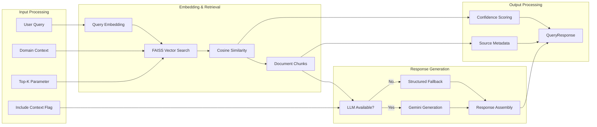
```mermaid
graph LR
    subgraph "Input Processing"
        USER_Q[User Query]
        DOMAIN[Domain Context]
        TOP_K[Top-K Parameter]
        CONTEXT_FLAG[Include Context Flag]
    end
    
    subgraph "Embedding & Retrieval"
        QUERY_EMB[Query Embedding]
        VECTOR_SEARCH[FAISS Vector Search]
        SIMILARITY[Cosine Similarity]
        CHUNK_RETRIEVAL[Document Chunks]
    end
    
    subgraph "Response Generation"
        LLM_CHECK[LLM Available?]
        GEMINI_GEN[Gemini Generation]
        FALLBACK_GEN[Structured Fallback]
        RESPONSE_ASSEMBLY[Response Assembly]
    end
    
    subgraph "Output Processing"
        SOURCES[Source Metadata]
        CONFIDENCE[Confidence Scoring]
        FINAL_RESPONSE[QueryResponse]
    end
    
    USER_Q --> QUERY_EMB
    DOMAIN --> VECTOR_SEARCH
    TOP_K --> VECTOR_SEARCH
    QUERY_EMB --> VECTOR_SEARCH
    VECTOR_SEARCH --> SIMILARITY
    SIMILARITY --> CHUNK_RETRIEVAL
    CHUNK_RETRIEVAL --> LLM_CHECK
    CONTEXT_FLAG --> LLM_CHECK
    LLM_CHECK -->|Yes| GEMINI_GEN
    LLM_CHECK -->|No| FALLBACK_GEN
    GEMINI_GEN --> RESPONSE_ASSEMBLY
    FALLBACK_GEN --> RESPONSE_ASSEMBLY
    CHUNK_RETRIEVAL --> SOURCES
    SIMILARITY --> CONFIDENCE
    RESPONSE_ASSEMBLY --> FINAL_RESPONSE
    SOURCES --> FINAL_RESPONSE
    CONFIDENCE --> FINAL_RESPONSE
```

### 2.2 RAG Pipeline Components Detail

#### 2.2.1 Query Processing Flow
```python
# Query Processing Pipeline
QUERY_PIPELINE = {
    "input_validation": "Domain existence check",
    "embedding_generation": "EmbeddingService.generate_embeddings()",
    "vector_search": "VectorStore.search(query_embedding, top_k)",
    "context_preparation": "Format chunks with metadata",
    "response_generation": "LLM or Fallback based on availability"
}
```

#### 2.2.2 Vector Search Process
```python
# FAISS Vector Search Flow
SEARCH_PROCESS = {
    "query_embedding": "768-dimensional vector (Gemini) or 384-d (sentence-transformers)",
    "normalization": "L2 normalization for cosine similarity",
    "similarity_calculation": "Inner product (IndexFlatIP)",
    "top_k_retrieval": "Configurable (default: 5)",
    "metadata_enrichment": "Source URLs, titles, chunk indices"
}
```

#### 2.2.3 Dual Response Generation
```python
# Response Generation Strategy
GENERATION_MODES = {
    "llm_mode": {
        "condition": "GEMINI_API_KEY available AND include_context=True",
        "engine": "Gemini 1.5 Flash",
        "prompt": "Senior engineer-level comprehensive prompt",
        "max_tokens": "4096",
        "temperature": "0.3"
    },
    "fallback_mode": {
        "condition": "LLM unavailable OR include_context=False",
        "engine": "Structured content processing",
        "features": ["TL;DR", "Overview", "Key Information", "Implementation Steps", "Sources"],
        "format": "Markdown with sections and confidence indicators"
    }
}
```

---

## 3. Data Flow Architecture

### 3.1 Complete System Data Flow

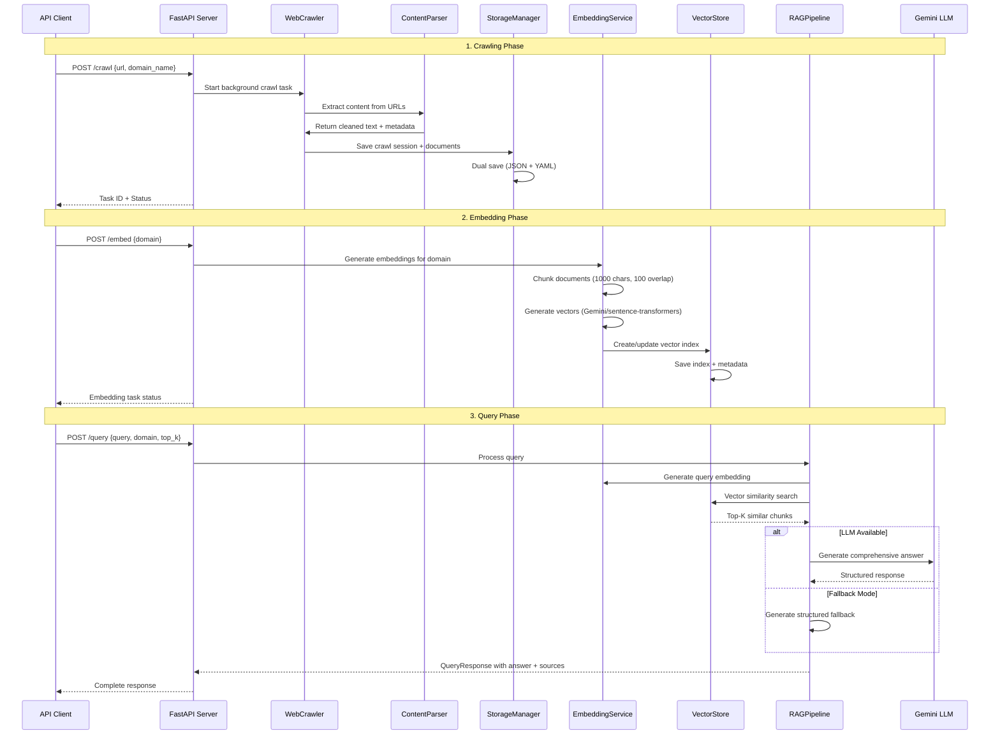
```mermaid
sequenceDiagram
    participant Client as API Client
    participant FastAPI as FastAPI Server
    participant Crawler as WebCrawler
    participant Parser as ContentParser
    participant Storage as StorageManager
    participant Embeddings as EmbeddingService
    participant FAISS as VectorStore
    participant RAG as RAGPipeline
    participant LLM as Gemini LLM

    Note over Client,LLM: 1. Crawling Phase
    Client->>FastAPI: POST /crawl {url, domain_name}
    FastAPI->>Crawler: Start background crawl task
    Crawler->>Parser: Extract content from URLs
    Parser->>Crawler: Return cleaned text + metadata
    Crawler->>Storage: Save crawl session + documents
    Storage->>Storage: Dual save (JSON + YAML)
    FastAPI-->>Client: Task ID + Status

    Note over Client,LLM: 2. Embedding Phase
    Client->>FastAPI: POST /embed {domain}
    FastAPI->>Embeddings: Generate embeddings for domain
    Embeddings->>Embeddings: Chunk documents (1000 chars, 100 overlap)
    Embeddings->>Embeddings: Generate vectors (Gemini/sentence-transformers)
    Embeddings->>FAISS: Create/update vector index
    FAISS->>FAISS: Save index + metadata
    FastAPI-->>Client: Embedding task status

    Note over Client,LLM: 3. Query Phase
    Client->>FastAPI: POST /query {query, domain, top_k}
    FastAPI->>RAG: Process query
    RAG->>Embeddings: Generate query embedding
    RAG->>FAISS: Vector similarity search
    FAISS-->>RAG: Top-K similar chunks
    alt LLM Available
        RAG->>LLM: Generate comprehensive answer
        LLM-->>RAG: Structured response
    else Fallback Mode
        RAG->>RAG: Generate structured fallback
    end
    RAG-->>FastAPI: QueryResponse with answer + sources
    FastAPI-->>Client: Complete response
```

### 3.2 Domain-Based Storage Architecture

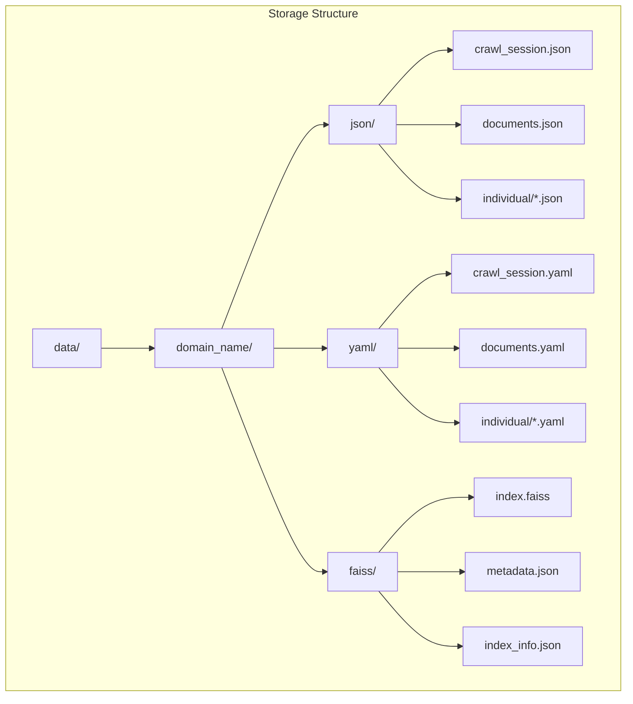
```mermaid
graph TB
    subgraph "Storage Structure"
        DATA_DIR[data/]
        DATA_DIR --> DOMAIN_FOLDER[domain_name/]
        DOMAIN_FOLDER --> JSON_DIR[json/]
        DOMAIN_FOLDER --> YAML_DIR[yaml/]
        DOMAIN_FOLDER --> FAISS_DIR[faiss/]

        JSON_DIR --> CRAWL_JSON[crawl_session.json]
        JSON_DIR --> DOCS_JSON[documents.json]
        JSON_DIR --> INDIVIDUAL_JSON[individual/*.json]

        YAML_DIR --> CRAWL_YAML[crawl_session.yaml]
        YAML_DIR --> DOCS_YAML[documents.yaml]
        YAML_DIR --> INDIVIDUAL_YAML[individual/*.yaml]

        FAISS_DIR --> INDEX_FILE[index.faiss]
        FAISS_DIR --> METADATA[metadata.json]
        FAISS_DIR --> INDEX_INFO[index_info.json]
    end
```
---

## 4. Component Deep Dive

### 4.1 Web Crawler Engine (`WebCrawler`)

```python
# Crawler Component Architecture
CRAWLER_COMPONENTS = {
    "session_management": "aiohttp.ClientSession with connection pooling",
    "url_handling": "URLUtils for normalization and validation",
    "content_extraction": "ContentParser with trafilatura",
    "concurrency_control": "Semaphore-based request limiting",
    "domain_restriction": "Base domain validation and filtering",
    "state_tracking": {
        "visited_urls": "Set for cycle prevention",
        "failed_urls": "Set for error tracking",
        "crawled_documents": "List of processed content"
    }
}

# Crawler Configuration
CRAWLER_CONFIG = {
    "max_concurrent_requests": 10,
    "request_timeout": 30,
    "retry_attempts": 3,
    "delay_between_requests": 1.0,
    "depth_limit": "configurable (default: unlimited)"
}
```

### 4.2 Storage Manager (`StorageManager`)

```python
# Storage Manager Architecture
STORAGE_FEATURES = {
    "dual_format": "Simultaneous JSON and YAML storage",
    "domain_organization": "Separate folders per crawled domain",
    "individual_files": "Per-document storage in individual/ subdirs",
    "metadata_preservation": "Complete URL, title, and content metadata",
    "session_tracking": "Crawl session information and statistics"
}

# Storage Operations
STORAGE_OPERATIONS = {
    "save_crawl_session": "Store crawling metadata and statistics",
    "save_documents": "Bulk document storage with dual format",
    "load_documents": "Retrieve documents by domain and format",
    "list_domains": "Get all crawled domains with stats",
    "get_domain_folder": "Create/verify domain folder structure"
}
```

### 4.3 Embedding Service (`EmbeddingService`)

```python
# Embedding Service Architecture
EMBEDDING_STRATEGY = {
    "primary_provider": {
        "service": "Google Generative AI",
        "model": "models/embedding-001",
        "dimension": 768,
        "api_key_required": True
    },
    "fallback_provider": {
        "service": "sentence-transformers",
        "model": "all-MiniLM-L6-v2",
        "dimension": 384,
        "local_execution": True
    },
    "chunking_strategy": {
        "chunk_size": 1000,
        "chunk_overlap": 100,
        "max_chunks_per_doc": 50
    }
}
```

### 4.4 Vector Store (`VectorStore`)

```python
# FAISS Vector Store Implementation
VECTOR_STORE_CONFIG = {
    "index_type": "IndexFlatIP (Inner Product for cosine similarity)",
    "storage_format": "Binary FAISS index + JSON metadata",
    "normalization": "L2 normalization for consistent similarity scores",
    "metadata_tracking": {
        "source_url": "Original document URL",
        "title": "Document title",
        "content": "Chunk content",
        "chunk_index": "Position within document"
    }
}

# Search Operations
SEARCH_CAPABILITIES = {
    "similarity_metric": "Cosine similarity via inner product",
    "top_k_retrieval": "Configurable result count (1-20)",
    "score_normalization": "Similarity scores between 0-1",
    "metadata_enrichment": "Full context with each result"
}
```

---

## 5. Advanced RAG Features

### 5.1 Comprehensive Prompt Engineering

```python
# Senior Engineer Prompt Template
PROMPT_STRUCTURE = {
    "role_definition": "Expert technical assistant (senior engineer/architect)",
    "output_format": "Complete, actionable, copy-pasteable technical guidance",
    "required_sections": [
        "TL;DR (1-3 sentence summary)",
        "Overview (architectural summary)",
        "Prerequisites (exact requirements)",
        "Architecture (diagrams + data flow)",
        "Step-by-step Implementation (numbered with verification)",
        "Example (minimal, runnable)",
        "Configuration & Secrets (.env keys, tokens)",
        "Advanced/Production Notes (scaling, monitoring)",
        "Troubleshooting (common failures + fixes)",
        "Next steps (3-6 concrete follow-ups)",
        "Checklist (actionable items)"
    ],
    "deliverables": [
        "Copy & Paste runnable section",
        "Verification block (3 quick checks)"
    ]
}
```

### 5.2 Intelligent Fallback System

```python
# Structured Fallback Generation
FALLBACK_FEATURES = {
    "content_analysis": {
        "main_topic_extraction": "Heuristic-based topic identification",
        "implementation_detection": "Keywords for setup/config content",
        "code_example_extraction": "Regex patterns for code blocks",
        "step_identification": "Numbered/bulleted step recognition"
    },
    "response_structure": {
        "tl_dr": "Auto-generated summary with source count",
        "overview": "Combined content from top results",
        "key_information": "Structured presentation of top 3 sources",
        "implementation_steps": "Extracted or generic actionable steps",
        "code_examples": "Formatted code blocks with language detection",
        "next_steps": "Context-aware recommendations",
        "sources": "Complete source list with relevance scores"
    },
    "confidence_indicators": {
        "high": "Score > 0.8 - Strong match found",
        "moderate": "Score > 0.6 - Good match, consider refinement",
        "low": "Score ≤ 0.6 - Limited matches, rephrase query"
    }
}
```

---

## 6. API Endpoint Architecture

### 6.1 Complete API Surface

```python
# FastAPI Endpoint Mapping
API_ENDPOINTS = {
    "health": {
        "method": "GET",
        "path": "/",
        "function": "health_check",
        "returns": "System status + available domains"
    },
    "crawl": {
        "method": "POST",
        "path": "/crawl",
        "function": "crawl_documentation",
        "background_task": "_crawl_task",
        "returns": "Task ID + crawl session info"
    },
    "embed": {
        "method": "POST",
        "path": "/embed",
        "function": "generate_embeddings",
        "background_task": "_embed_task",
        "returns": "Task ID + embedding status"
    },
    "query": {
        "method": "POST",
        "path": "/query",
        "function": "query_documentation",
        "returns": "Answer + sources + confidence + timing"
    },
    "domains": {
        "method": "GET",
        "path": "/domains",
        "function": "list_domains",
        "returns": "Domain info + embedding status"
    },
    "documents": {
        "method": "GET",
        "path": "/domains/{domain_name}/documents",
        "function": "get_domain_documents",
        "returns": "Document list by format (JSON/YAML)"
    },
    "task_status": {
        "method": "GET",
        "path": "/tasks/{task_id}",
        "function": "get_task_status",
        "returns": "Background task progress"
    },
    "system_status": {
        "method": "GET",
        "path": "/status",
        "function": "get_system_status",
        "returns": "Pipeline info + domain stats"
    }
}
```

### 6.2 Background Task Management

```python
# Background Task Architecture
TASK_MANAGEMENT = {
    "task_tracking": {
        "storage": "In-memory dictionary with UUID keys",
        "metadata": ["type", "status", "start_time", "domain", "progress"],
        "states": ["started", "processing", "completed", "failed"]
    },
    "crawl_tasks": {
        "function": "_crawl_task",
        "operations": ["URL validation", "WebCrawler execution", "Document storage"],
        "error_handling": "Comprehensive exception capture + logging"
    },
    "embed_tasks": {
        "function": "_embed_task",
        "operations": ["Document loading", "Chunking", "Embedding generation", "FAISS indexing"],
        "progress_tracking": "Chunk count + processing time"
    }
}
```

---

## 7. Micro-Level Component Diagrams

### 7.1 WebCrawler Internal Architecture

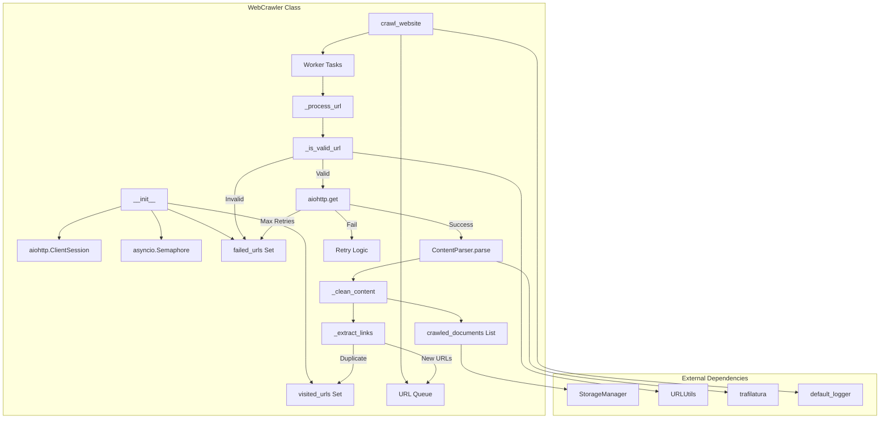
```mermaid
flowchart TD
    subgraph "WebCrawler Class"
        INIT[__init__]
        CRAWL[crawl_website]
        PROCESS[_process_url]
        EXTRACT[_extract_links]
        VALIDATE[_is_valid_url]
        CLEAN[_clean_content]

        INIT --> SESSION_POOL[aiohttp.ClientSession]
        INIT --> SEMAPHORE[asyncio.Semaphore]
        INIT --> VISITED_SET[visited_urls Set]
        INIT --> FAILED_SET[failed_urls Set]

        CRAWL --> URL_QUEUE[URL Queue]
        CRAWL --> WORKERS[Worker Tasks]

        WORKERS --> PROCESS
        PROCESS --> VALIDATE
        VALIDATE --> |Valid| HTTP_REQUEST[aiohttp.get]
        VALIDATE --> |Invalid| FAILED_SET

        HTTP_REQUEST --> |Success| CONTENT_PARSER[ContentParser.parse]
        HTTP_REQUEST --> |Fail| RETRY_LOGIC[Retry Logic]
        HTTP_REQUEST --> |Max Retries| FAILED_SET

        CONTENT_PARSER --> CLEAN
        CLEAN --> EXTRACT
        EXTRACT --> |New URLs| URL_QUEUE
        EXTRACT --> |Duplicate| VISITED_SET

        CLEAN --> DOCUMENT_LIST[crawled_documents List]
    end

    subgraph "External Dependencies"
        STORAGE_MGR[StorageManager]
        URL_UTILS[URLUtils]
        TRAFILATURA[trafilatura]
        LOGGER[default_logger]
    end

    DOCUMENT_LIST --> STORAGE_MGR
    VALIDATE --> URL_UTILS
    CONTENT_PARSER --> TRAFILATURA
    CRAWL --> LOGGER
```

### 7.2 EmbeddingService Internal Architecture

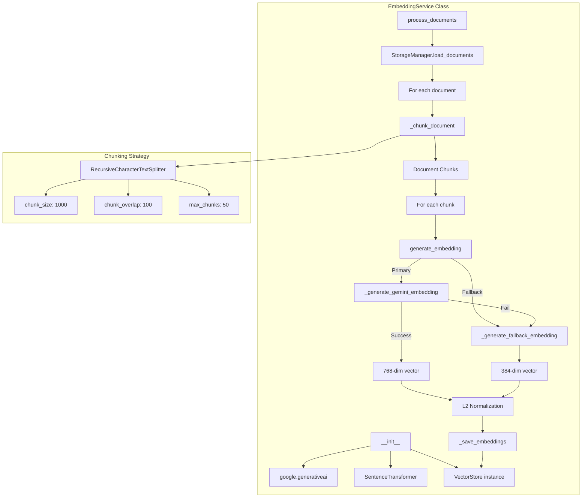
```mermaid
flowchart TD
    subgraph "EmbeddingService Class"
        INIT_EMB[__init__]
        PROCESS_DOCS[process_documents]
        CHUNK_DOC[_chunk_document]
        GEN_EMBEDDING[generate_embedding]
        GEMINI_EMB[_generate_gemini_embedding]
        FALLBACK_EMB[_generate_fallback_embedding]
        SAVE_EMBS[_save_embeddings]

        INIT_EMB --> GEMINI_CLIENT[google.generativeai]
        INIT_EMB --> ST_MODEL[SentenceTransformer]
        INIT_EMB --> VECTOR_STORE[VectorStore instance]

        PROCESS_DOCS --> LOAD_DOCS[StorageManager.load_documents]
        LOAD_DOCS --> DOC_LOOP[For each document]

        DOC_LOOP --> CHUNK_DOC
        CHUNK_DOC --> CHUNK_LIST[Document Chunks]
        CHUNK_LIST --> EMBEDDING_LOOP[For each chunk]

        EMBEDDING_LOOP --> GEN_EMBEDDING
        GEN_EMBEDDING --> |Primary| GEMINI_EMB
        GEN_EMBEDDING --> |Fallback| FALLBACK_EMB

        GEMINI_EMB --> |Success| VECTOR_768[768-dim vector]
        GEMINI_EMB --> |Fail| FALLBACK_EMB

        FALLBACK_EMB --> VECTOR_384[384-dim vector]

        VECTOR_768 --> NORMALIZE[L2 Normalization]
        VECTOR_384 --> NORMALIZE
        NORMALIZE --> SAVE_EMBS

        SAVE_EMBS --> VECTOR_STORE
    end

    subgraph "Chunking Strategy"
        TEXT_SPLIT[RecursiveCharacterTextSplitter]
        CHUNK_SIZE[chunk_size: 1000]
        OVERLAP[chunk_overlap: 100]
        MAX_CHUNKS[max_chunks: 50]

        CHUNK_DOC --> TEXT_SPLIT
        TEXT_SPLIT --> CHUNK_SIZE
        TEXT_SPLIT --> OVERLAP
        TEXT_SPLIT --> MAX_CHUNKS
    end
```

### 7.3 RAGPipeline Internal Architecture

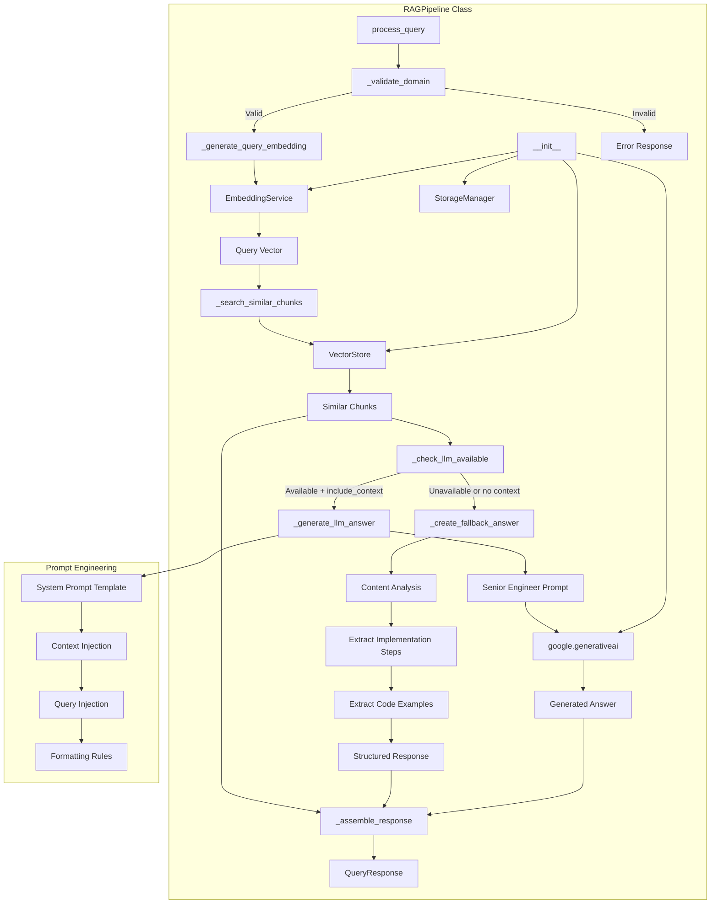
```mermaid
flowchart TD
    subgraph "RAGPipeline Class"
        INIT_RAG[__init__]
        QUERY[process_query]
        VALIDATE_DOM[_validate_domain]
        GEN_Q_EMB[_generate_query_embedding]
        SEARCH_SIM[_search_similar_chunks]
        CHECK_LLM[_check_llm_available]
        GEN_LLM_ANS[_generate_llm_answer]
        CREATE_FALLBACK[_create_fallback_answer]
        ASSEMBLE_RESP[_assemble_response]

        INIT_RAG --> LLM_CLIENT[google.generativeai]
        INIT_RAG --> EMBED_SERVICE[EmbeddingService]
        INIT_RAG --> VECTOR_STORE[VectorStore]
        INIT_RAG --> STORAGE_MGR[StorageManager]

        QUERY --> VALIDATE_DOM
        VALIDATE_DOM --> |Valid| GEN_Q_EMB
        VALIDATE_DOM --> |Invalid| ERROR_RESP[Error Response]

        GEN_Q_EMB --> EMBED_SERVICE
        EMBED_SERVICE --> QUERY_VECTOR[Query Vector]

        QUERY_VECTOR --> SEARCH_SIM
        SEARCH_SIM --> VECTOR_STORE
        VECTOR_STORE --> SIMILAR_CHUNKS[Similar Chunks]

        SIMILAR_CHUNKS --> CHECK_LLM
        CHECK_LLM --> |Available + include_context| GEN_LLM_ANS
        CHECK_LLM --> |Unavailable or no context| CREATE_FALLBACK

        GEN_LLM_ANS --> PROMPT_TEMPLATE[Senior Engineer Prompt]
        PROMPT_TEMPLATE --> LLM_CLIENT
        LLM_CLIENT --> LLM_RESPONSE[Generated Answer]

        CREATE_FALLBACK --> ANALYZE_CONTENT[Content Analysis]
        ANALYZE_CONTENT --> EXTRACT_STEPS[Extract Implementation Steps]
        EXTRACT_STEPS --> EXTRACT_CODE[Extract Code Examples]
        EXTRACT_CODE --> STRUCTURED_RESP[Structured Response]

        LLM_RESPONSE --> ASSEMBLE_RESP
        STRUCTURED_RESP --> ASSEMBLE_RESP
        SIMILAR_CHUNKS --> ASSEMBLE_RESP

        ASSEMBLE_RESP --> FINAL_RESPONSE[QueryResponse]
    end

    subgraph "Prompt Engineering"
        SYS_PROMPT[System Prompt Template]
        CONTEXT_INJECT[Context Injection]
        QUERY_INJECT[Query Injection]
        FORMAT_RULES[Formatting Rules]

        GEN_LLM_ANS --> SYS_PROMPT
        SYS_PROMPT --> CONTEXT_INJECT
        CONTEXT_INJECT --> QUERY_INJECT
        QUERY_INJECT --> FORMAT_RULES
    end
```

### 7.4 VectorStore Internal Architecture

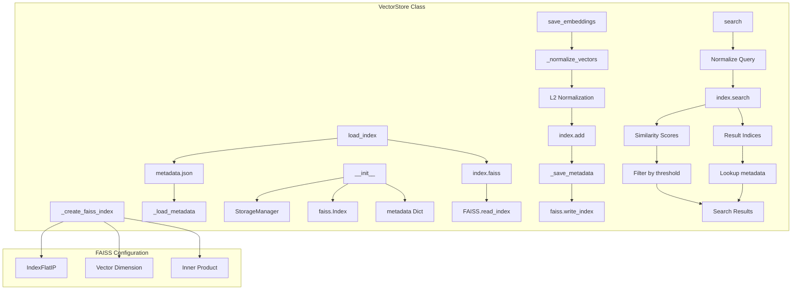
```mermaid
flowchart TD
    subgraph "VectorStore Class"
        INIT_VS[__init__]
        LOAD_INDEX[load_index]
        SAVE_EMBS[save_embeddings]
        SEARCH[search]
        CREATE_INDEX[_create_faiss_index]
        NORM_VECTORS[_normalize_vectors]
        SAVE_METADATA[_save_metadata]
        LOAD_METADATA[_load_metadata]

        INIT_VS --> STORAGE_MGR[StorageManager]
        INIT_VS --> FAISS_INDEX[faiss.Index]
        INIT_VS --> METADATA_DICT[metadata Dict]

        LOAD_INDEX --> INDEX_FILE[index.faiss]
        LOAD_INDEX --> METADATA_FILE[metadata.json]
        INDEX_FILE --> FAISS.read_index
        METADATA_FILE --> LOAD_METADATA

        SAVE_EMBS --> NORM_VECTORS
        NORM_VECTORS --> L2_NORM[L2 Normalization]
        L2_NORM --> ADD_TO_INDEX[index.add]
        ADD_TO_INDEX --> SAVE_METADATA
        SAVE_METADATA --> SAVE_INDEX[faiss.write_index]

        SEARCH --> QUERY_NORM[Normalize Query]
        QUERY_NORM --> INDEX_SEARCH[index.search]
        INDEX_SEARCH --> SCORES[Similarity Scores]
        INDEX_SEARCH --> INDICES[Result Indices]

        SCORES --> FILTER_RESULTS[Filter by threshold]
        INDICES --> LOOKUP_METADATA[Lookup metadata]
        FILTER_RESULTS --> SEARCH_RESULTS[Search Results]
        LOOKUP_METADATA --> SEARCH_RESULTS
    end

    subgraph "FAISS Configuration"
        INDEX_TYPE[IndexFlatIP]
        DIMENSION[Vector Dimension]
        METRIC[Inner Product]

        CREATE_INDEX --> INDEX_TYPE
        CREATE_INDEX --> DIMENSION
        CREATE_INDEX --> METRIC
    end
```

### 7.5 StorageManager Internal Architecture

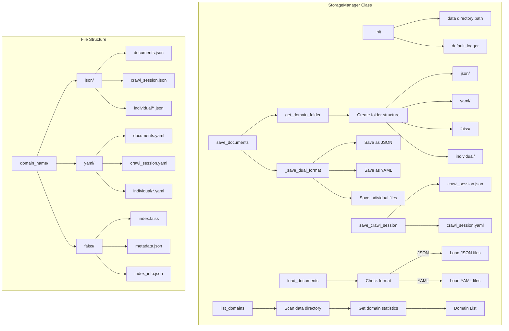
```mermaid
flowchart TD
    subgraph "StorageManager Class"
        INIT_SM[__init__]
        SAVE_DOCS[save_documents]
        SAVE_SESSION[save_crawl_session]
        LOAD_DOCS[load_documents]
        GET_DOMAIN_FOLDER[get_domain_folder]
        LIST_DOMAINS[list_domains]
        DUAL_SAVE[_save_dual_format]

        INIT_SM --> DATA_DIR[data directory path]
        INIT_SM --> LOGGER[default_logger]

        SAVE_DOCS --> GET_DOMAIN_FOLDER
        GET_DOMAIN_FOLDER --> CREATE_STRUCTURE[Create folder structure]
        CREATE_STRUCTURE --> JSON_DIR[json/]
        CREATE_STRUCTURE --> YAML_DIR[yaml/]
        CREATE_STRUCTURE --> FAISS_DIR[faiss/]
        CREATE_STRUCTURE --> INDIVIDUAL_DIR[individual/]

        SAVE_DOCS --> DUAL_SAVE
        DUAL_SAVE --> SAVE_JSON[Save as JSON]
        DUAL_SAVE --> SAVE_YAML[Save as YAML]
        DUAL_SAVE --> SAVE_INDIVIDUAL[Save individual files]

        SAVE_SESSION --> SESSION_JSON[crawl_session.json]
        SAVE_SESSION --> SESSION_YAML[crawl_session.yaml]

        LOAD_DOCS --> FORMAT_CHECK[Check format]
        FORMAT_CHECK --> |JSON| LOAD_JSON[Load JSON files]
        FORMAT_CHECK --> |YAML| LOAD_YAML[Load YAML files]

        LIST_DOMAINS --> SCAN_DIRS[Scan data directory]
        SCAN_DIRS --> GET_STATS[Get domain statistics]
        GET_STATS --> DOMAIN_LIST[Domain List]
    end

    subgraph "File Structure"
        DOMAIN_FOLDER[domain_name/]
        DOMAIN_FOLDER --> JSON_FOLDER[json/]
        DOMAIN_FOLDER --> YAML_FOLDER[yaml/]
        DOMAIN_FOLDER --> FAISS_FOLDER[faiss/]

        JSON_FOLDER --> DOCS_JSON[documents.json]
        JSON_FOLDER --> CRAWL_JSON[crawl_session.json]
        JSON_FOLDER --> INDIV_JSON[individual/*.json]

        YAML_FOLDER --> DOCS_YAML[documents.yaml]
        YAML_FOLDER --> CRAWL_YAML[crawl_session.yaml]
        YAML_FOLDER --> INDIV_YAML[individual/*.yaml]

        FAISS_FOLDER --> INDEX_FAISS[index.faiss]
        FAISS_FOLDER --> METADATA_JSON[metadata.json]
        FAISS_FOLDER --> INDEX_INFO[index_info.json]
    end
```

### 7.6 DocumentCrawlerAPI Internal Architecture

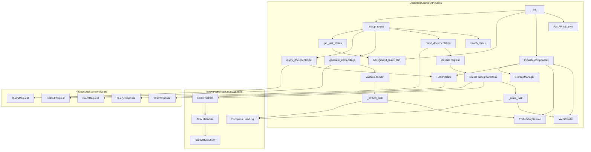
```mermaid
flowchart TD
    subgraph "DocumentCrawlerAPI Class"
        INIT_API[__init__]
        SETUP_ROUTES[_setup_routes]
        HEALTH[health_check]
        CRAWL_ENDPOINT[crawl_documentation]
        EMBED_ENDPOINT[generate_embeddings]
        QUERY_ENDPOINT[query_documentation]
        TASK_STATUS[get_task_status]
        
        INIT_API --> FASTAPI_APP[FastAPI instance]
        INIT_API --> COMPONENTS[Initialize components]
        COMPONENTS --> WEB_CRAWLER[WebCrawler]
        COMPONENTS --> EMBED_SERVICE[EmbeddingService]
        COMPONENTS --> RAG_PIPELINE[RAGPipeline]
        COMPONENTS --> STORAGE_MGR[StorageManager]
        
        INIT_API --> BG_TASKS[background_tasks: Dict]
        INIT_API --> SETUP_ROUTES
        
        SETUP_ROUTES --> HEALTH
        SETUP_ROUTES --> CRAWL_ENDPOINT
        SETUP_ROUTES --> EMBED_ENDPOINT
        SETUP_ROUTES --> QUERY_ENDPOINT
        SETUP_ROUTES --> TASK_STATUS
        
        CRAWL_ENDPOINT --> VALIDATE_REQ[Validate request]
        VALIDATE_REQ --> CREATE_TASK[Create background task]
        CREATE_TASK --> CRAWL_TASK[_crawl_task]
        
        EMBED_ENDPOINT --> VALIDATE_DOMAIN[Validate domain]
        VALIDATE_DOMAIN --> EMBED_TASK[_embed_task]
        
        QUERY_ENDPOINT --> RAG_PIPELINE
        
        CRAWL_TASK --> WEB_CRAWLER
        EMBED_TASK --> EMBED_SERVICE
        
        TASK_STATUS --> BG_TASKS
    end
    
    subgraph "Background Task Management"
        TASK_ID[UUID Task ID]
        TASK_META[Task Metadata]
        TASK_STATUS_ENUM[TaskStatus Enum]
        ERROR_HANDLING[Exception Handling]
        
        CREATE_TASK --> TASK_ID
        TASK_ID --> TASK_META
        TASK_META --> TASK_STATUS_ENUM
        CRAWL_TASK --> ERROR_HANDLING
        EMBED_TASK --> ERROR_HANDLING
    end
    
    subgraph "Request/Response Models"
        CRAWL_REQUEST[CrawlRequest]
        EMBED_REQUEST[EmbedRequest]
        QUERY_REQUEST[QueryRequest]
        TASK_RESPONSE[TaskResponse]
        QUERY_RESPONSE[QueryResponse]
        
        CRAWL_ENDPOINT --> CRAWL_REQUEST
        EMBED_ENDPOINT --> EMBED_REQUEST
        QUERY_ENDPOINT --> QUERY_REQUEST
        CREATE_TASK --> TASK_RESPONSE
        RAG_PIPELINE --> QUERY_RESPONSE
    end
```

### 7.1 Settings Architecture

```python
# Configuration System
SETTINGS_STRUCTURE = {
    "api_keys": {
        "GEMINI_API_KEY": "Google Generative AI authentication",
    },
    "crawler_settings": {
        "MAX_CONCURRENT_REQUESTS": 10,
        "REQUEST_TIMEOUT": 30,
        "RETRY_ATTEMPTS": 3,
        "DELAY_BETWEEN_REQUESTS": 1.0
    },
    "storage_settings": {
        "DATA_DIR": "./data",
        "LOG_LEVEL": "INFO"
    },
    "embedding_settings": {
        "CHUNK_SIZE": 1000,
        "CHUNK_OVERLAP": 100,
        "MAX_CHUNKS_PER_DOC": 50
    },
    "llm_settings": {
        "LLM_TEMPERATURE": 0.3,
        "LLM_MAX_TOKENS": 4096,
        "RAG_CONTEXT_CHUNKS": 5,
        "RAG_CONTENT_LENGTH": 1500
    },
    "faiss_settings": {
        "FAISS_INDEX_TYPE": "IndexFlatIP",
        "VECTOR_DIMENSION": "384 (fallback) / 768 (Gemini)"
    }
}
```

---

## 8. Detailed Function Call Flows

### 8.1 Complete Crawl Process Flow

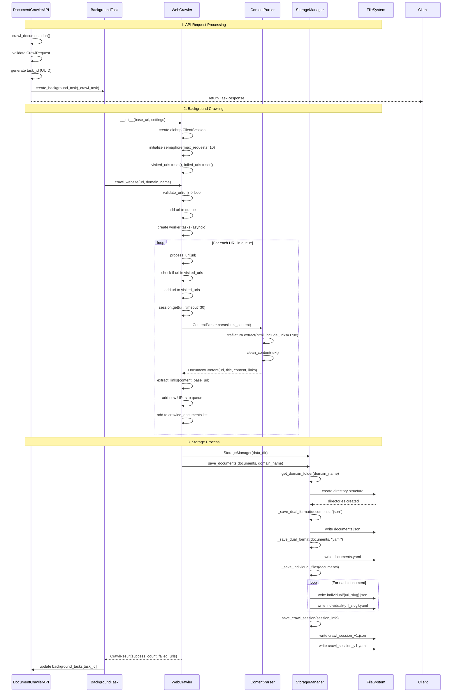
```mermaid
sequenceDiagram
    participant API as DocumentCrawlerAPI
    participant BG as BackgroundTask
    participant WC as WebCrawler
    participant CP as ContentParser
    participant SM as StorageManager
    participant FS as FileSystem

    Note over API,FS: 1. API Request Processing
    API->>API: crawl_documentation()
    API->>API: validate CrawlRequest
    API->>API: generate task_id (UUID)
    API->>BG: create_background_task(_crawl_task)
    API-->>Client: return TaskResponse

    Note over API,FS: 2. Background Crawling
    BG->>WC: __init__(base_url, settings)
    WC->>WC: create aiohttp.ClientSession
    WC->>WC: initialize semaphore(max_requests=10)
    WC->>WC: visited_urls = set(), failed_urls = set()

    BG->>WC: crawl_website(url, domain_name)
    WC->>WC: validate_url(url) -> bool
    WC->>WC: add url to queue
    WC->>WC: create worker tasks (asyncio)

    loop For each URL in queue
        WC->>WC: _process_url(url)
        WC->>WC: check if url in visited_urls
        WC->>WC: add url to visited_urls
        WC->>WC: session.get(url, timeout=30)
        WC->>CP: ContentParser.parse(html_content)
        CP->>CP: trafilatura.extract(html, include_links=True)
        CP->>CP: clean_content(text)
        CP-->>WC: DocumentContent(url, title, content, links)
        WC->>WC: _extract_links(content, base_url)
        WC->>WC: add new URLs to queue
        WC->>WC: add to crawled_documents list
    end

    Note over API,FS: 3. Storage Process
    WC->>SM: StorageManager(data_dir)
    WC->>SM: save_documents(documents, domain_name)
    SM->>SM: get_domain_folder(domain_name)
    SM->>FS: create directory structure
    FS-->>SM: directories created
    SM->>SM: _save_dual_format(documents, "json")
    SM->>FS: write documents.json
    SM->>SM: _save_dual_format(documents, "yaml") 
    SM->>FS: write documents.yaml
    SM->>SM: _save_individual_files(documents)
    loop For each document
        SM->>FS: write individual/{url_slug}.json
        SM->>FS: write individual/{url_slug}.yaml
    end
    SM->>SM: save_crawl_session(session_info)
    SM->>FS: write crawl_session_v1.json
    SM->>FS: write crawl_session_v1.yaml

    WC-->>BG: CrawlResult(success, count, failed_urls)
    BG->>API: update background_tasks[task_id]
```

### 8.2 Complete Embedding Process Flow

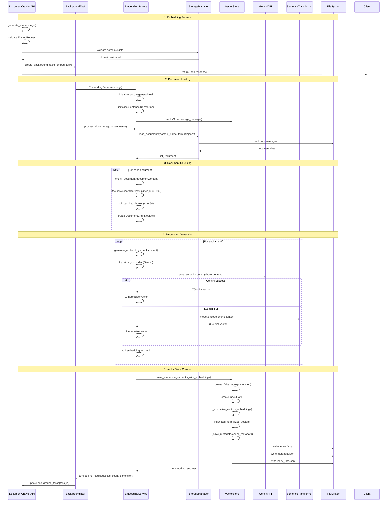
```mermaid
sequenceDiagram
    participant API as DocumentCrawlerAPI
    participant BG as BackgroundTask
    participant ES as EmbeddingService
    participant SM as StorageManager
    participant VS as VectorStore
    participant GEMINI as GeminiAPI
    participant ST as SentenceTransformer
    participant FS as FileSystem

    Note over API,FS: 1. Embedding Request
    API->>API: generate_embeddings()
    API->>API: validate EmbedRequest
    API->>SM: validate domain exists
    SM-->>API: domain validated
    API->>BG: create_background_task(_embed_task)
    API-->>Client: return TaskResponse

    Note over API,FS: 2. Document Loading
    BG->>ES: EmbeddingService(settings)
    ES->>ES: initialize google.generativeai
    ES->>ES: initialize SentenceTransformer
    ES->>VS: VectorStore(storage_manager)

    BG->>ES: process_documents(domain_name)
    ES->>SM: load_documents(domain_name, format="json")
    SM->>FS: read documents.json
    FS-->>SM: document data
    SM-->>ES: List[Document]

    Note over API,FS: 3. Document Chunking
    loop For each document
        ES->>ES: _chunk_document(document.content)
        ES->>ES: RecursiveCharacterTextSplitter(1000, 100)
        ES->>ES: split text into chunks (max 50)
        ES->>ES: create DocumentChunk objects
    end

    Note over API,FS: 4. Embedding Generation
    loop For each chunk
        ES->>ES: generate_embedding(chunk.content)
        ES->>ES: try primary provider (Gemini)
        ES->>GEMINI: genai.embed_content(chunk.content)
        alt Gemini Success
            GEMINI-->>ES: 768-dim vector
            ES->>ES: L2 normalize vector
        else Gemini Fail
            ES->>ST: model.encode(chunk.content)
            ST-->>ES: 384-dim vector
            ES->>ES: L2 normalize vector
        end
        ES->>ES: add embedding to chunk
    end

    Note over API,FS: 5. Vector Store Creation
    ES->>VS: save_embeddings(chunks_with_embeddings)
    VS->>VS: _create_faiss_index(dimension)
    VS->>VS: create IndexFlatIP
    VS->>VS: _normalize_vectors(embeddings)
    VS->>VS: index.add(normalized_vectors)
    VS->>VS: _save_metadata(chunk_metadata)
    VS->>FS: write index.faiss
    VS->>FS: write metadata.json
    VS->>FS: write index_info.json
    VS-->>ES: embedding_success

    ES-->>BG: EmbeddingResult(success, count, dimension)
    BG->>API: update background_tasks[task_id]
```

### 8.3 Complete Query Process Flow

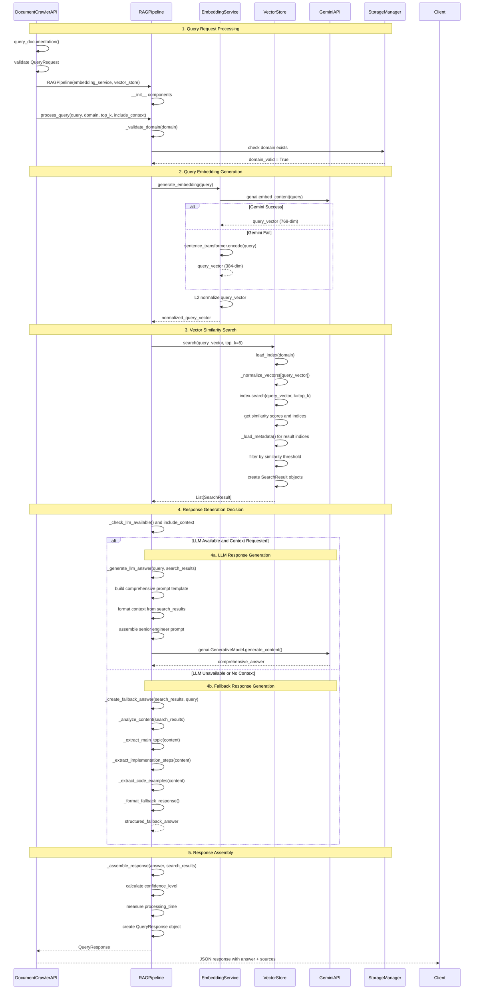
```mermaid
sequenceDiagram
    participant API as DocumentCrawlerAPI
    participant RAG as RAGPipeline
    participant ES as EmbeddingService
    participant VS as VectorStore
    participant GEMINI as GeminiAPI
    participant SM as StorageManager

    Note over API,SM: 1. Query Request Processing
    API->>API: query_documentation()
    API->>API: validate QueryRequest
    API->>RAG: RAGPipeline(embedding_service, vector_store)
    RAG->>RAG: __init__ components

    API->>RAG: process_query(query, domain, top_k, include_context)
    RAG->>RAG: _validate_domain(domain)
    RAG->>SM: check domain exists
    SM-->>RAG: domain_valid = True

    Note over API,SM: 2. Query Embedding Generation
    RAG->>ES: generate_embedding(query)
    ES->>GEMINI: genai.embed_content(query)
    alt Gemini Success
        GEMINI-->>ES: query_vector (768-dim)
    else Gemini Fail
        ES->>ES: sentence_transformer.encode(query)
        ES-->>ES: query_vector (384-dim)
    end
    ES->>ES: L2 normalize query_vector
    ES-->>RAG: normalized_query_vector

    Note over API,SM: 3. Vector Similarity Search
    RAG->>VS: search(query_vector, top_k=5)
    VS->>VS: load_index(domain)
    VS->>VS: _normalize_vectors([query_vector])
    VS->>VS: index.search(query_vector, k=top_k)
    VS->>VS: get similarity scores and indices
    VS->>VS: _load_metadata() for result indices
    VS->>VS: filter by similarity threshold
    VS->>VS: create SearchResult objects
    VS-->>RAG: List[SearchResult]

    Note over API,SM: 4. Response Generation Decision
    RAG->>RAG: _check_llm_available() and include_context
    alt LLM Available and Context Requested
        Note over RAG,GEMINI: 4a. LLM Response Generation
        RAG->>RAG: _generate_llm_answer(query, search_results)
        RAG->>RAG: build comprehensive prompt template
        RAG->>RAG: format context from search_results
        RAG->>RAG: assemble senior engineer prompt
        RAG->>GEMINI: genai.GenerativeModel.generate_content()
        GEMINI-->>RAG: comprehensive_answer
    else LLM Unavailable or No Context
        Note over RAG,GEMINI: 4b. Fallback Response Generation
        RAG->>RAG: _create_fallback_answer(search_results, query)
        RAG->>RAG: _analyze_content(search_results)
        RAG->>RAG: _extract_main_topic(content)
        RAG->>RAG: _extract_implementation_steps(content)
        RAG->>RAG: _extract_code_examples(content)
        RAG->>RAG: _format_fallback_response()
        RAG-->>RAG: structured_fallback_answer
    end

    Note over API,SM: 5. Response Assembly
    RAG->>RAG: _assemble_response(answer, search_results)
    RAG->>RAG: calculate confidence_level
    RAG->>RAG: measure processing_time
    RAG->>RAG: create QueryResponse object
    RAG-->>API: QueryResponse

    API-->>Client: JSON response with answer + sources
```

### 8.4 Configuration Loading Flow

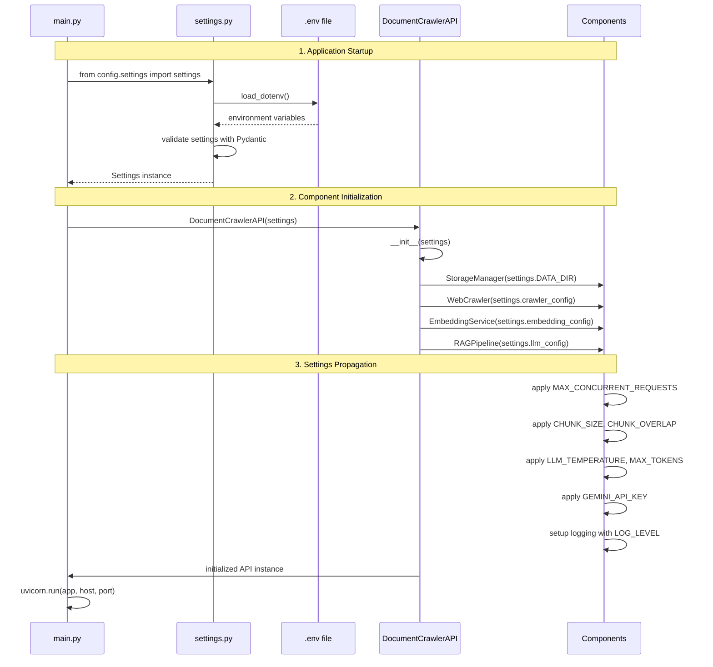
```mermaid
sequenceDiagram
    participant MAIN as main.py
    participant SETTINGS as settings.py
    participant ENV as .env file
    participant API as DocumentCrawlerAPI
    participant COMPONENTS as Components

    Note over MAIN,COMPONENTS: 1. Application Startup
    MAIN->>SETTINGS: from config.settings import settings
    SETTINGS->>ENV: load_dotenv()
    ENV-->>SETTINGS: environment variables
    SETTINGS->>SETTINGS: validate settings with Pydantic
    SETTINGS-->>MAIN: Settings instance

    Note over MAIN,COMPONENTS: 2. Component Initialization
    MAIN->>API: DocumentCrawlerAPI(settings)
    API->>API: __init__(settings)
    
    API->>COMPONENTS: StorageManager(settings.DATA_DIR)
    API->>COMPONENTS: WebCrawler(settings.crawler_config)
    API->>COMPONENTS: EmbeddingService(settings.embedding_config)
    API->>COMPONENTS: RAGPipeline(settings.llm_config)

    Note over MAIN,COMPONENTS: 3. Settings Propagation
    COMPONENTS->>COMPONENTS: apply MAX_CONCURRENT_REQUESTS
    COMPONENTS->>COMPONENTS: apply CHUNK_SIZE, CHUNK_OVERLAP
    COMPONENTS->>COMPONENTS: apply LLM_TEMPERATURE, MAX_TOKENS
    COMPONENTS->>COMPONENTS: apply GEMINI_API_KEY
    COMPONENTS->>COMPONENTS: setup logging with LOG_LEVEL

    API->>MAIN: initialized API instance
    MAIN->>MAIN: uvicorn.run(app, host, port)
```

### 8.5 Error Handling Flow


```mermaid
flowchart TD
    subgraph "Error Handling Patterns"
        TRY_CATCH[try/except blocks]
        LOG_ERROR[default_logger.error]
        FALLBACK[Fallback mechanisms]
        USER_RESP[User-friendly response]
        
        TRY_CATCH --> LOG_ERROR
        LOG_ERROR --> FALLBACK
        FALLBACK --> USER_RESP
    end
    
    subgraph "API Level Errors"
        API_ERROR[API Exception]
        HTTP_STATUS[HTTP Status Code]
        ERROR_MODEL[ErrorResponse Model]
        
        API_ERROR --> HTTP_STATUS
        HTTP_STATUS --> ERROR_MODEL
    end
    
    subgraph "Service Level Errors"
        GEMINI_QUOTA[Gemini API Quota]
        NETWORK_ERROR[Network Timeout]
        FILE_ERROR[File System Error]
        
        GEMINI_QUOTA --> SENTENCE_TRANS[Switch to SentenceTransformer]
        NETWORK_ERROR --> RETRY_LOGIC[Retry with backoff]
        FILE_ERROR --> ERROR_LOG[Log and continue]
    end
    
    subgraph "Background Task Errors"
        TASK_EXCEPTION[Task Exception]
        TASK_STATUS[Update task status to 'failed']
        ERROR_DETAILS[Store error details]
        
        TASK_EXCEPTION --> TASK_STATUS
        TASK_STATUS --> ERROR_DETAILS
    end
```

---

## 9. Error Handling & Resilience

### 8.1 Error Handling Strategy

```python
# Comprehensive Error Handling
ERROR_HANDLING = {
    "import_path_resolution": "Complex fallback import system for module loading",
    "api_failures": "Graceful degradation from Gemini to fallback embeddings/generation",
    "vector_store_errors": "Index validation and rebuilding capabilities",
    "crawler_failures": "URL validation, retry logic, failed URL tracking",
    "background_task_errors": "Exception capture with detailed error storage",
    "llm_failures": "Automatic fallback to structured response generation"
}
```

### 8.2 Logging Architecture

```python
# Logging System
LOGGING_CONFIG = {
    "default_logger": "Centralized logging via utils.logger",
    "module_specific": "Per-module logger setup with configurable levels",
    "structured_logging": "Consistent format across all components",
    "error_tracking": "Detailed exception logging with context",
    "performance_metrics": "Query timing, confidence scores, processing statistics"
}
```

---

## 9. Performance & Scalability Considerations

### 9.1 Performance Optimizations

```python
# Performance Features
PERFORMANCE_OPTIMIZATIONS = {
    "async_architecture": "Full async/await implementation throughout",
    "connection_pooling": "aiohttp session reuse for crawler",
    "vector_search": "FAISS for high-performance similarity search",
    "chunking_strategy": "Optimized chunk size for embedding efficiency",
    "background_processing": "Non-blocking crawl and embed operations",
    "caching": "Vector store persistence for reuse across sessions"
}
```

### 9.2 Scaling Strategies

```python
# Scalability Considerations
SCALABILITY_FEATURES = {
    "domain_isolation": "Separate vector stores per domain",
    "concurrent_crawling": "Configurable request concurrency",
    "memory_management": "Efficient FAISS index loading/unloading",
    "stateless_design": "API endpoints designed for horizontal scaling",
    "background_task_tracking": "Distributed task management ready"
}
```

---

## 10. Development Workflow Integration

### 10.1 Development Patterns

```python
# Development Best Practices
DEV_PATTERNS = {
    "import_management": "Sophisticated fallback import system",
    "testing_workflow": "test_crawl.py for development validation",
    "configuration_management": ".env.example for setup guidance",
    "error_debugging": "Comprehensive logging for troubleshooting",
    "modular_architecture": "Clear separation of concerns across components"
}
```

### 10.2 Deployment Architecture

```python
# Deployment Configuration
DEPLOYMENT_SETUP = {
    "entry_points": ["src/main.py", "run_server.py"],
    "environment_setup": "Virtual environment with requirements.txt",
    "configuration": ".env file with API keys and settings",
    "data_persistence": "Local file system storage for domains and vectors",
    "api_server": "FastAPI with Uvicorn for production deployment"
}
```

---

## 9. Domain-Based Storage Architecture

### 9.1 File System Organization

```mermaid
graph TD
    subgraph "Root Data Directory"
        DATA_DIR[data/]
        DATA_DIR --> LOGS_DIR[logs/]
        DATA_DIR --> DOMAIN_DIRS[domain-specific folders]
    end

    subgraph "Domain Structure"
        DOMAIN_FOLDER[domain_name/]
        DOMAIN_FOLDER --> JSON_DIR[json/]
        DOMAIN_FOLDER --> YAML_DIR[yaml/]
        DOMAIN_FOLDER --> FAISS_DIR[faiss/]
    end

    subgraph "JSON Storage"
        JSON_DIR --> DOCS_JSON[documents.json]
        JSON_DIR --> CRAWL_JSON[crawl_session_v1.json]
        JSON_DIR --> INDIV_JSON[individual/]
    end

    subgraph "YAML Storage"
        YAML_DIR --> DOCS_YAML[documents.yaml]
        YAML_DIR --> CRAWL_YAML[crawl_session_v1.yaml]
        YAML_DIR --> INDIV_YAML[individual/]
    end

    subgraph "FAISS Vector Store"
        FAISS_DIR --> INDEX_FAISS[index.faiss]
        FAISS_DIR --> METADATA_JSON[metadata.json]
        FAISS_DIR --> INDEX_INFO[index_info.json]
    end

    subgraph "Individual Documents"
        INDIV_JSON --> DOC1_JSON[doc1.json]
        INDIV_JSON --> DOC2_JSON[doc2.json]
        INDIV_YAML --> DOC1_YAML[doc1.yaml]
        INDIV_YAML --> DOC2_YAML[doc2.yaml]
    end

    subgraph "Application Logs"
        LOGS_DIR --> APP_LOG[app.log]
        LOGS_DIR --> CRAWLER_LOG[crawler_20250919.log]
    end
```

### 9.2 Storage Format Specifications

```python
# Domain-Based Storage Structure
DOMAIN_STORAGE = {
    "domain_folder": {
        "json/": {
            "documents.json": "Complete document collection (JSON)",
            "crawl_session_v1.json": "Crawling session metadata",
            "individual/": {
                "{url_slug}.json": "Individual document files"
            }
        },
        "yaml/": {
            "documents.yaml": "Complete document collection (YAML)",
            "crawl_session_v1.yaml": "Crawling session metadata",
            "individual/": {
                "{url_slug}.yaml": "Individual document files"
            }
        },
        "faiss/": {
            "index.faiss": "FAISS vector index (IndexFlatIP)",
            "metadata.json": "Document chunk metadata and mappings",
            "index_info.json": "Index configuration and statistics"
        }
    }
}

# File Format Specifications
FILE_FORMATS = {
    "json_format": {
        "documents": "List[DocumentContent] - Full document objects",
        "chunks": "List[ContentChunk] - Embedding-ready chunks",
        "metadata": "Dict[str, Any] - Index and processing metadata"
    },
    "yaml_format": {
        "purpose": "Human-readable storage and inspection",
        "structure": "Same as JSON but YAML formatted",
        "usage": "Manual review and debugging"
    },
    "faiss_format": {
        "index_type": "IndexFlatIP for cosine similarity",
        "vector_dimensions": "768 (Gemini) or 384 (sentence-transformers)",
        "normalization": "L2 normalized vectors",
        "metric": "Inner product (cosine similarity)"
    }
}
```

---

## 10. Performance & Scalability Considerations

### 10.1 Performance Metrics

```python
# Key Performance Indicators
PERFORMANCE_METRICS = {
    "crawling_performance": {
        "concurrent_requests": "10 simultaneous connections",
        "request_timeout": "30 seconds per URL",
        "retry_logic": "3 attempts with exponential backoff",
        "rate_limiting": "1 second delay between requests"
    },
    "embedding_performance": {
        "chunk_size": "1000 characters with 100 overlap",
        "max_chunks_per_doc": "50 chunks maximum",
        "batch_processing": "Sequential chunk processing",
        "vector_dimensions": "768d (Gemini) / 384d (fallback)"
    },
    "vector_search_performance": {
        "index_type": "FAISS IndexFlatIP",
        "similarity_metric": "Cosine similarity",
        "search_latency": "< 100ms for top-k retrieval",
        "memory_usage": "Efficient for domain-isolated indexes"
    },
    "llm_response_performance": {
        "generation_time": "< 2 seconds average",
        "temperature": "0.3 for consistent responses",
        "max_tokens": "4096 tokens per response",
        "fallback_mode": "Instant structured responses"
    }
}

# Optimization Strategies
OPTIMIZATIONS = {
    "async_architecture": "Full async/await implementation",
    "connection_pooling": "aiohttp session reuse",
    "vector_optimization": "FAISS for high-performance search",
    "memory_management": "Lazy loading and efficient structures",
    "background_processing": "Non-blocking operations"
}
```

### 10.2 Scalability Architecture

```python
# Horizontal Scaling Options
SCALING_STRATEGIES = {
    "domain_isolation": "Separate vector stores per crawled domain",
    "concurrent_processing": "Configurable request concurrency limits",
    "stateless_api": "FastAPI endpoints ready for load balancing",
    "background_tasks": "Distributed task management ready",
    "storage_scaling": "File-based storage migrates to databases",
    "vector_db_scaling": "FAISS indexes per domain, load on demand"
}

# Resource Optimization
RESOURCE_OPTIMIZATION = {
    "memory_usage": {
        "vector_indexes": "Loaded on-demand per domain",
        "document_storage": "File-based with efficient serialization",
        "session_management": "aiohttp connection pooling"
    },
    "cpu_usage": {
        "embedding_generation": "Batch processing with fallbacks",
        "vector_search": "FAISS optimized operations",
        "content_processing": "Async processing pipelines"
    },
    "storage_optimization": {
        "dual_format": "JSON for processing, YAML for inspection",
        "compression": "Efficient serialization formats",
        "domain_partitioning": "Isolated storage per domain"
    }
}
```

---

## 11. Security Architecture

### 11.1 Security Layers

```python
# Security Implementation
SECURITY_MEASURES = {
    "api_key_management": {
        "storage": "Environment variables only",
        "rotation": "Automatic fallback mechanisms",
        "exposure_prevention": "No logging of sensitive keys",
        "validation": "Pydantic settings validation"
    },
    "input_validation": {
        "url_validation": "URLUtils.is_valid_url() checks",
        "request_validation": "Pydantic models for all inputs",
        "domain_restriction": "Domain-based crawling restrictions",
        "content_sanitization": "trafilatura content extraction"
    },
    "error_handling": {
        "sensitive_data": "No API keys in error messages",
        "logging_safety": "Structured logging without secrets",
        "fallback_security": "Secure degradation without exposure",
        "rate_limiting": "Built-in concurrency controls"
    },
    "data_protection": {
        "file_permissions": "Standard OS file permissions",
        "data_isolation": "Domain-based data separation",
        "access_control": "Local file system security",
        "audit_trail": "Comprehensive operation logging"
    }
}
```

---

## 12. Deployment Architecture

### 12.1 Production Deployment Flow

```mermaid
C4Deployment
    title AI-Powered Documentation Crawler - Production Deployment

    Deployment_Node(dev_env, "Development Environment", "Local Machine") {
        Container(source_code, "Source Code", "Python", "Application source")
        Container(test_suite, "Test Suite", "pytest", "Unit and integration tests")
        Container(env_config, "Environment Config", ".env", "API keys and settings")
    }

    Deployment_Node(build_env, "Build Environment", "CI/CD") {
        Container(dependency_install, "Dependencies", "pip", "Python package installation")
        Container(code_quality, "Code Quality", "linting", "Code analysis and testing")
        Container(container_build, "Container Build", "Docker", "Application containerization")
    }

    Deployment_Node(prod_env, "Production Environment", "Cloud/Server") {
        Deployment_Node(app_server, "Application Server", "Ubuntu/Python") {
            Container(fastapi_app, "FastAPI Application", "Uvicorn", "REST API server")
            Container(bg_tasks, "Background Tasks", "asyncio", "Async task processing")
        }

        Deployment_Node(storage, "Storage Layer", "File System") {
            Container(domain_data, "Domain Data", "JSON/YAML", "Document storage")
            Container(vector_indexes, "Vector Indexes", "FAISS", "Similarity search")
            Container(logs, "Application Logs", "Text", "Operation logging")
        }
    }

    Deployment_Node(external_services, "External Services", "Cloud APIs") {
        Container_Boundary(gemini_api, "Google Gemini API") {
            SystemQueue(llm_service, "LLM Service", "Text generation")
            SystemQueue(embedding_service, "Embedding Service", "Vector generation")
        }

        System_Ext(target_sites, "Documentation Websites", "Content sources")
    }

    Rel(dev_env, build_env, "Code push")
    Rel(build_env, prod_env, "Deploy container")
    Rel(fastapi_app, bg_tasks, "Async task delegation")
    Rel(bg_tasks, target_sites, "HTTP crawling requests")
    Rel(bg_tasks, gemini_api, "API calls for embeddings/LLM")
    Rel(fastapi_app, storage, "Data persistence")
    Rel(bg_tasks, storage, "Store crawled content")
```

### 12.2 Deployment Configuration

```python
# Production Deployment Setup
DEPLOYMENT_CONFIG = {
    "application": {
        "framework": "FastAPI with Uvicorn",
        "port": 8000,
        "workers": "Multiple Uvicorn workers",
        "host": "0.0.0.0 for container deployment"
    },
    "environment": {
        "python_version": "Python 3.12+",
        "virtual_environment": "venv or conda",
        "dependencies": "requirements.txt",
        "environment_variables": ".env file"
    },
    "data_persistence": {
        "storage_type": "Local file system",
        "domain_isolation": "Per-domain directories",
        "backup_strategy": "File system backups",
        "migration_path": "Ready for database migration"
    },
    "monitoring": {
        "health_checks": "/health endpoint",
        "logging": "Structured application logs",
        "performance": "Built-in timing metrics",
        "error_tracking": "Comprehensive error logging"
    }
}
```

---

## 13. Monitoring & Observability

### 13.1 Monitoring Stack

```python
# Observability Components
MONITORING_ARCHITECTURE = {
    "application_logs": {
        "fastapi_logs": "Request/response logging with timing",
        "crawler_logs": "Crawling operation tracking",
        "embedding_logs": "Embedding generation monitoring",
        "rag_logs": "Query processing and response metrics",
        "error_logs": "Exception tracking with context"
    },
    "performance_metrics": {
        "api_performance": "Endpoint response times and throughput",
        "crawling_metrics": "URLs processed, success/failure rates",
        "embedding_metrics": "Processing time, chunk counts, dimensions",
        "vector_search_metrics": "Query latency, similarity scores",
        "llm_metrics": "Generation time, token usage, fallback rates"
    },
    "business_metrics": {
        "usage_analytics": "Query volume, domain popularity",
        "content_metrics": "Documents crawled, domains indexed",
        "quality_metrics": "Response confidence, user satisfaction",
        "system_health": "Background task success rates"
    },
    "infrastructure_metrics": {
        "resource_usage": "Memory, CPU, disk I/O",
        "external_api": "Gemini API usage and quotas",
        "storage_metrics": "Domain sizes, file counts",
        "concurrency": "Active connections and tasks"
    }
}
```

---

## 14. Future Architecture Enhancements

### 14.1 Recommended Improvements

```python
# Architecture Evolution Roadmap
FUTURE_ENHANCEMENTS = {
    "distributed_processing": {
        "technology": "Redis/Celery for background tasks",
        "purpose": "Horizontal scaling of crawling and embedding",
        "impact": "Handle larger documentation sites concurrently"
    },
    "advanced_caching": {
        "technology": "Redis for response and vector caching",
        "purpose": "Reduce API costs and improve performance",
        "impact": "Faster responses for common queries"
    },
    "database_migration": {
        "technology": "PostgreSQL/MongoDB integration",
        "purpose": "Scalable storage beyond file system limits",
        "impact": "Support for larger document collections"
    },
    "real_time_features": {
        "technology": "WebSocket connections",
        "purpose": "Live crawling progress and status updates",
        "impact": "Better user experience for long-running tasks"
    },
    "advanced_rag": {
        "techniques": ["Query decomposition", "Multi-step reasoning", "Context ranking"],
        "purpose": "Improved answer quality and relevance",
        "impact": "More accurate and comprehensive responses"
    },
    "enterprise_security": {
        "technology": "OAuth2, RBAC, audit logging",
        "purpose": "Enterprise-grade security and compliance",
        "impact": "Production deployment in regulated environments"
    }
}
```

---

## 15. Comprehensive Architecture Summary

### 15.1 System Integration Overview

The AI-Powered Documentation Crawler represents a sophisticated, production-ready RAG system with the following architectural strengths:

#### **Multi-Layer Architecture**

- **Presentation Layer**: FastAPI with OpenAPI documentation and async request handling
- **Application Services**: Background task management, request validation, and API orchestration
- **Core Business Logic**: Domain-specific services (Crawler, Embedding, RAG, Storage)
- **Infrastructure Services**: Configuration, logging, error handling, and health monitoring
- **Data Access Layer**: File system operations, vector store management, and metadata handling
- **External Integration**: Gemini API, sentence-transformers, and web content sources

#### **Advanced RAG Capabilities**

- **Dual Response Generation**: Comprehensive LLM-powered responses with intelligent structured fallbacks
- **Senior Engineer Prompt Engineering**: Production-ready prompt templates for actionable technical guidance
- **Multi-Provider Embedding**: Primary Gemini embeddings with sentence-transformer fallback
- **High-Performance Vector Search**: FAISS IndexFlatIP with cosine similarity and sub-second query response
- **Domain-Based Organization**: Isolated vector stores and document collections per crawled domain

#### **Enterprise-Ready Features**

- **Comprehensive Error Handling**: Multi-level fallback systems with graceful degradation
- **Async-First Architecture**: Full async/await implementation for maximum performance
- **Background Processing**: Non-blocking crawl and embedding operations with progress tracking
- **Dual-Format Storage**: Simultaneous JSON/YAML persistence for machine and human readability
- **Advanced Monitoring**: Structured logging, health checks, and performance metrics### 15.2 Data Flow Integrity

```mermaid
graph LR
    subgraph "Input Validation"
        URL_VALID[URL Validation]
        DOMAIN_CHECK[Domain Verification]
        REQUEST_VALID[Request Validation]
    end

    subgraph "Processing Pipeline"
        CONTENT_EXTRACT[Content Extraction]
        DUAL_STORAGE[Dual Format Storage]
        VECTOR_GEN[Vector Generation]
        INDEX_CREATE[Index Creation]
    end

    subgraph "Query Processing"
        EMBED_QUERY[Query Embedding]
        VECTOR_SEARCH[Similarity Search]
        CONTEXT_ASSEMBLY[Context Assembly]
        RESPONSE_GEN[Response Generation]
    end

    subgraph "Output Quality"
        CONFIDENCE_CALC[Confidence Calculation]
        SOURCE_TRACK[Source Tracking]
        STRUCTURED_RESP[Structured Response]
    end

    URL_VALID --> CONTENT_EXTRACT
    DOMAIN_CHECK --> DUAL_STORAGE
    REQUEST_VALID --> EMBED_QUERY

    CONTENT_EXTRACT --> DUAL_STORAGE
    DUAL_STORAGE --> VECTOR_GEN
    VECTOR_GEN --> INDEX_CREATE

    EMBED_QUERY --> VECTOR_SEARCH
    VECTOR_SEARCH --> CONTEXT_ASSEMBLY
    CONTEXT_ASSEMBLY --> RESPONSE_GEN

    RESPONSE_GEN --> CONFIDENCE_CALC
    CONFIDENCE_CALC --> SOURCE_TRACK
    SOURCE_TRACK --> STRUCTURED_RESP
```

### 15.3 Operational Excellence

#### **Development Workflow**

- **Complex Import Resolution**: Sophisticated fallback import system for reliable module loading
- **Testing Framework**: `test_crawl.py` with comprehensive development validation workflows
- **Configuration Management**: Environment-based settings with intelligent defaults
- **Documentation**: Auto-generated OpenAPI docs with interactive testing interface

#### **Production Readiness**

- **Scalability**: Domain isolation for horizontal scaling, configurable concurrency controls
- **Reliability**: Multi-provider fallbacks, comprehensive error handling, and data consistency checks
- **Maintainability**: Clear separation of concerns, modular architecture, and extensive logging
- **Monitoring**: Health checks, performance metrics, and detailed operational visibility

#### **Performance Characteristics**

- **Crawling**: 10 concurrent requests with retry logic and rate limiting
- **Embedding**: Batch processing with 1000-character chunks and 100-character overlap
- **Vector Search**: Sub-second similarity search with FAISS optimization
- **Response Generation**: 0.3 temperature for consistent, professional responses

### 15.4 Future Enhancement Roadmap

The current architecture supports natural evolution toward:

#### **Horizontal Scaling**

- **Distributed Processing**: Background tasks ready for Redis/Celery integration
- **Load Balancing**: Stateless API design supports multiple instance deployment
- **Database Migration**: File-based storage can migrate to PostgreSQL/MongoDB
- **Caching Layer**: Redis integration for vector store and response caching

#### **Advanced Features**

- **Multi-Modal Support**: Architecture supports image and document processing extensions
- **Real-Time Updates**: WebSocket integration for live crawling progress
- **Advanced Analytics**: Query pattern analysis and content recommendation systems
- **Enterprise Security**: OAuth2, RBAC, and audit logging integration points

#### **AI/ML Enhancements**

- **Model Fine-Tuning**: Custom embedding models for domain-specific optimization
- **Advanced RAG**: Hypothetical document embeddings, multi-step reasoning
- **Quality Scoring**: Automated content quality assessment and filtering
- **Semantic Routing**: Dynamic model selection based on query complexity

### 15.5 Technical Specifications Summary

```python
# Complete System Specifications
SYSTEM_SPECS = {
    "architecture_type": "Microservices-oriented with clear service boundaries",
    "api_framework": "FastAPI with async/await throughout",
    "storage_pattern": "Domain-based with JSON/YAML dual format",
    "vector_database": "FAISS with IndexFlatIP for cosine similarity",
    "embedding_models": "Gemini-001 (768d) with sentence-transformers fallback (384d)",
    "llm_integration": "Gemini 1.5 Flash with comprehensive prompt engineering",
    "concurrency_model": "AsyncIO with semaphore-based request limiting",
    "error_handling": "Multi-level fallbacks with graceful degradation",
    "monitoring": "Structured logging with performance metrics",
    "configuration": "Environment-based with Pydantic validation",
    "testing": "Comprehensive development validation framework",
    "documentation": "Auto-generated OpenAPI with interactive interface"
}
```

This comprehensive micro-level architecture documentation provides both the high-level understanding and detailed technical specifications necessary for developers, architects, and operations teams to effectively work with, maintain, and extend the AI-Powered Documentation Crawler system.